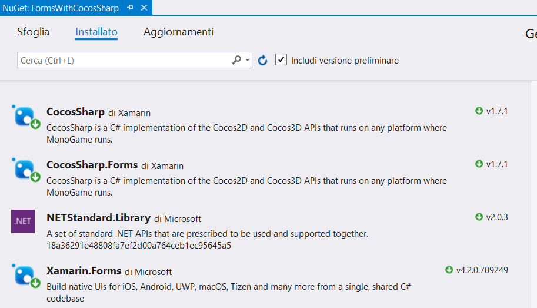
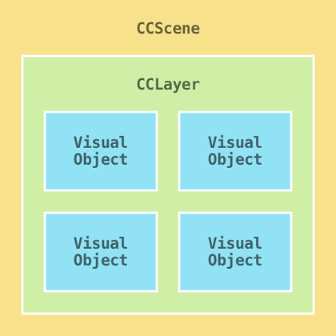
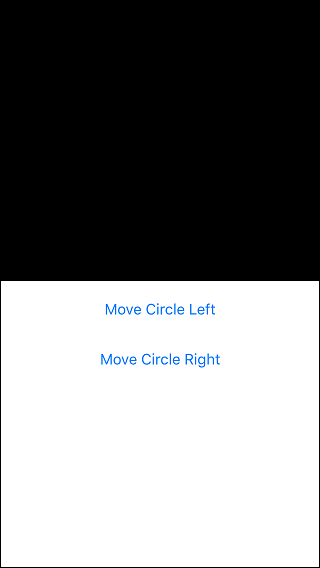
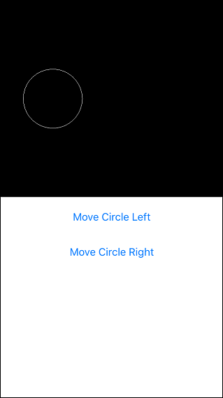
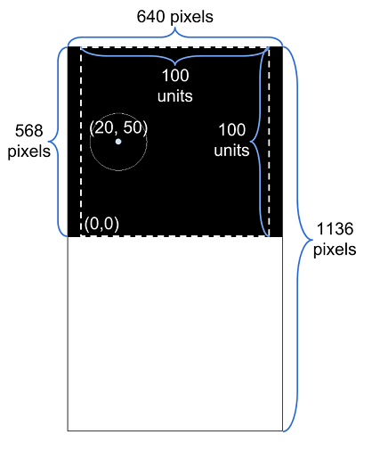
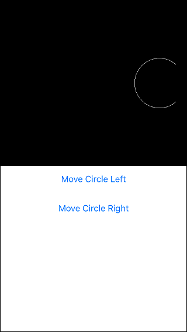

# CocosSharp in Xamarin.Forms


## Introduzione

CocosSharp è una tecnologia potente e flessibile per la visualizzazione di grafica, la lettura dell'input tocco, la riproduzione di audio e la gestione dei contenuti. 

[CocosSharp](https://github.com/xamarin/docs-archive/blob/master/Docs/CocosSharp/index.md) è un motore di gioco open source che è disponibile nella piattaforma Xamarin. CocosSharp è una libreria di runtime efficiente che include le funzionalità seguenti.

- Rendering di immagini con la classe `CCSprite` .
- Rendering delle forme usando la classe `CCDrawNode` .
- Logica di ogni frame che usa la classe `CCNode.Schedule` .
- Gestione dei contenuti, caricamento e scaricamento di risorse, ad esempio file con estensione **PNG** (*Portable Network Graphics*) con il`CCTextureCache`.
- Animazioni con la classe `CCAction` .

Obiettivo principale di CocosSharp consiste nel semplificare la creazione di giochi 2D multipiattaforma. Tuttavia, può essere anche un'aggiunta importante per le applicazioni Xamarin Form. Poiché i giochi richiedono in genere un rendering efficiente e un controllo preciso su oggetti visivi, CocosSharp è utilizzabile per aggiungere potenti funzionalità di visualizzazione e gli effetti alle app non di gioco.

Xamarin.Forms si basa su sistemi dell'**UI** (*User Interface*) nativi specifici della piattaforma. Ad esempio, [`Button`s](https://docs.microsoft.com/it-it/dotnet/api/xamarin.forms.button) sono visualizzati in modo diverso in iOS e Android e persino potrebbe differire dalle versioni del **SO** (*Sistema Operativo*). Al contrario, CocosSharp non usa oggetti visivi specifici della piattaforma, in modo che tutti gli oggetti visivi sembrano identici in tutte le piattaforme. Naturalmente, la risoluzione e le proporzioni differiscono tra i dispositivi e ciò può influire sul modo in cui CocosSharp esegue il rendering dei rispettivi oggetti visivi. 


## Creare una soluzione

È composta da tre progetti.

1. ***FormsWithCocosSharp***: libreria .NET Standard dove sarà scritto tutto il codice.
2. ***FormsWithCocosSharp.Droid***.
3.  ***FormsWithCocosSharp.iOS***.

Il pacchetto Nuget di ***CocosSharp*** contiene tutti gli oggetti necessari per creare oggetti CocosSharp. Il pacchetto nuget ***CocosSharp.Forms*** include la classe`CocosSharpView`  che è usata per ospitare CocosSharp in xamarin.Forms.  

Fare clic sulla cartella ***Dipendenze*** e selezionare ***Gestisci pacchetti NuGet...*** . Immettere il termine di ricerca,  selezionare e quindi fare clic su **Installa**.



#### 1. Creazione di una pagina Xamarin.Forms 

CocosSharp può essere ospitatio in qualsiasi contenitore di xamarin.Forms. In questo progetto per questa pagina è utilizzata una pagina denominata `HomePage`. `HomePage` è divisa in metà da un `Grid` per mostrare come xamarin.Forms CocosSharp può eseguire il rendering e contemporaneamente nella stessa pagina.

Innanzitutto, impostare la pagina in modo che contenga una `Grid` e due `Button` .

File Pages\MainPage.cs

```csharp
using System;
using Xamarin.Forms;
using CocosSharp;

namespace FormsWithCocosSharp
{
    public class MainPage : ContentPage
    {
        // mantenere il GameScene nell'ambito della classe in modo che gli eventi clic del pulsante possano accedervi
        private GameScene gameScene;

        public MainPage()
        {
            // questa è la griglia di primo livello che dividerà la nostra pagina a metà
            var grid = new Grid();
            grid.RowSpacing = 0;
            this.Content = grid;
            grid.RowDefinitions = new RowDefinitionCollection {
				// ogni metà sarà della stessa dimensione
				new RowDefinition{ Height = new GridLength(1, GridUnitType.Star)},
                new RowDefinition{ Height = new GridLength(1, GridUnitType.Star)},
            };
            CreateTopHalf(grid);
            CreateBottomHalf(grid);
        }

        private void CreateTopHalf(Grid grid)
        {
            // questo ospita la nostra vista di gioco
            var gameView = new CocosSharpView()
            {
                /* ha le stesse proprietà di altre visualizzazioni XamarinForms
                 * questo è chiamato dopo CocosSharp avviato */
                HorizontalOptions = LayoutOptions.FillAndExpand,
                VerticalOptions = LayoutOptions.FillAndExpand,
                ViewCreated = HandleViewCreated
            };
            // lo aggiungeremo alla metà superiore (riga 0)
            grid.Children.Add(gameView, 0, 0);
        }

        private void CreateBottomHalf(Grid grid)
        {
            // useremo un StackLayout per organizzare i nostri pulsanti
            var stackLayout = new StackLayout();
            // i primo pulsante sposterà il cerchio a sinistra quando si fa clic
            var moveLeftButton = new Button
            {
                Text = "Move Circle Left"
            };
            moveLeftButton.Clicked += (sender, e) => gameScene.MoveCircleLeft();
            stackLayout.Children.Add(moveLeftButton);
            // il secondo pulsante sposterà il cerchio a destra quando si fa clic su
            var moveCircleRight = new Button
            {
                Text = "Sposta il cerchio a destra"
            };
            moveCircleRight.Clicked += (sender, e) => gameScene.MoveCircleRight();
            stackLayout.Children.Add(moveCircleRight);
            // il layout dello stack sarà nella metà inferiore (riga 1)
            grid.Children.Add(stackLayout, 0, 1);
        }

        /* LoadGame è chiamato quando CocosSharp è inizializzato,
         * possiamo iniziare a creare i nostri oggetti CocosSharp qui */

        private void HandleViewCreated(object sender, EventArgs e)
        {
            var gameView = sender as CCGameView;
            if (gameView != null)
            {
                // imposta la risoluzione "mondo" del gioco su 100x100
                gameView.DesignResolution = new CCSizeI(100, 100);
                // GameScene è la radice della gerarchia di rendering CocosSharp
                gameScene = new GameScene(gameView);
                // start CocosSharp
                gameView.RunWithScene(gameScene);
            }
        }
    }
}
```

#### 2. Aggiunta di un CocosSharpView

La classe`CocosSharpView` è utilizzata per incorporare CocosSharp in un'app xamarin. Forms. Poiché `CocosSharpView` eredita dalla classe `View` , offre un'interfaccia familiare per il layout e può essere utilizzata all'interno di contenitori di layout, ad esempio [Xamarin.Forms.Grid](https://docs.microsoft.com/it-it/dotnet/api/xamarin.forms.grid). Aggiungere un nuovo `CocosSharpView` al progetto completando il metodo `CreateTopHalf` .

```csharp
        private void CreateTopHalf(Grid grid)
        {
            // questo ospita la nostra vista di gioco
            var gameView = new CocosSharpView()
            {
                /* ha le stesse proprietà di altre visualizzazioni XamarinForms
                 * questo è chiamato dopo CocosSharp avviato */
                HorizontalOptions = LayoutOptions.FillAndExpand,
                VerticalOptions = LayoutOptions.FillAndExpand,
                ViewCreated = HandleViewCreated
            };
            // lo aggiungeremo alla metà superiore (riga 0)
            grid.Children.Add(gameView, 0, 0);
        }

```

L'inizializzazione di CocosSharp non è immediata, quindi, registrare un evento quando il `CocosSharpView` ha completato la sua creazione. Eseguire questa operazione nel metodo `HandleViewCreated` .

```csharp
        private void HandleViewCreated(object sender, EventArgs e)
        {
            var gameView = sender as CCGameView;
            if (gameView != null)
            {
                // imposta la risoluzione "mondo" del gioco su 100x100
                gameView.DesignResolution = new CCSizeI(100, 100);
                // GameScene è la radice della gerarchia di rendering CocosSharp
                gameScene = new GameScene(gameView);
                // start CocosSharp
                gameView.RunWithScene(gameScene);
            }
        }

```

Il metodo `HandleViewCreated` ha due informazioni importanti.

1. La classe  `GameScene`  che sarà creata nella sezione successiva. È importante notare che l'app non sarà compilato finché il `GameScene` è creato e `gameScene` fa riferimento ad un'istanza che è risolta.
2. La proprietà `DesignResolution` definisce l'area visibile del gioco per gli oggetti CocosSharp. La proprietà`DesignResolution` è da esaminare dopo aver creato `GameScene`.

#### 3. Creazione di GameScene

La classe `GameScene` eredita da CocosSharp `CCScene`.  Il codice contenuto in `GameScene` funzionerà in qualsiasi app di CocosSharp.

La classe `CCScene` è l'oggetto visivo radice di tutti i rendering CocosSharp. Qualsiasi oggetto CocosSharp visibile dev'essere contenuto all'interno di un `CCScene`. In particolare, gli oggetti visivi devono essere aggiunti alle istanze di `CCLayer` e  `CCLayer` e deve essere aggiunto ad un `CCScene`.

Gerarchia di CocosSharp.



Un solo `CCScene` può essere attivo contemporaneamente. La maggior parte dei giochi usano più istanze  `CCLayer` per ordinare il contenuto, ma l'app ne utilizza solo uno. Analogamente, la maggior parte dei giochi utilizzano più oggetti visivi ma sarà solo uno nell'app. 

Inizialmente la classe`GameScene` sarà quasi vuota, si limita a creare il riferimento in `HomePage`. Aggiungere una nuova classe al progetto della libreria .NET Standard denominato `GameScene`. Il controller deve ereditare dalla classe `CCScene` .

```csharp
public class GameScene : CCScene
{
    public GameScene (CCGameView gameView) : base(gameView)
    {

    }
}
```

A questo punto `GameScene` è definito, è possibile tornare a `HomePage` e aggiungere un campo.

```csharp
// mantenere GameScene nello scope della classe
// in modo che gli eventi click del pulsante possano accedervi
GameScene gameScene;
```

È ora possibile compilare il progetto ed eseguirlo per vedere CocosSharp in esecuzione. È ancora stato aggiunto nulla al nostro `GameScene,` quindi nella metà superiore della pagina è nero, il colore predefinito di una scena CocosSharp.



#### 4. Aggiunta di un cerchio

L'app è attualmente un'istanza del motore di CocosSharp, visualizzazione di un oggetto vuoto in esecuzione `CCScene`. Successivamente, sarà aggiunto un oggetto visivo: un cerchio. La classe`CCDrawNode` può essere utilizzata per disegnare un'ampia gamma di forme geometriche, come descritto nel [disegno della geometria con CCDrawNode Guida](https://github.com/xamarin/docs-archive/blob/master/Docs/CocosSharp/ccdrawnode.md).

Aggiungere un cerchio alla classe `GameScene` e crearne un'istanza nel costruttore come illustrato nel codice seguente.

```csharp
    public class GameScene : CCScene
    {
        private CCDrawNode circle;

        public GameScene(CCGameView gameView) : base(gameView)
        {
            var layer = new CCLayer();
            this.AddLayer(layer);
            circle = new CCDrawNode();
            layer.AddChild(circle);
            // centro da utilizzare quando si disegna il cerchio, relativo al CCDrawNode
            circle.DrawCircle(new CCPoint(0, 0), radius: 15, color: CCColor4B.White);
            circle.PositionX = 20;
            circle.PositionY = 50;
        }
```

A questo punto l'esecuzione dell'app mostra un cerchio sul lato sinistro dell'area di visualizzazione CocosSharp.



Ora che è visualizzato un oggetto visivo CocosSharp, è possibile analizzare la proprietà`DesignResolution` .

Il `DesignResolution` rappresenta la larghezza e altezza dell'area di CocosSharp per posizionare e ridimensionare gli oggetti. La risoluzione effettiva dell'area è misurata in *pixel* mentre il `DesignResolution` è misurato nel mondo *unità*. La figura seguente illustra la risoluzione (le dimensioni in pixel all'esterno della schermata di testo di colore nero) delle varie parti della visualizzazione con una risoluzione dello schermo pari a 640 x 1136 pixel.



- L'origine dello schermo CocosSharp è in basso a sinistra. Spostandosi quindi verso destra aumenta il valore di X, nonché spostando verso l'alto il valore Y. Si noti che il valore Y è invertito rispetto ad alcuni altri motori di layout 2D, in cui (0,0) è in alto a sinistra dell'area di disegno.
- Il comportamento predefinito di CocosSharp consiste nel mantenere le proporzioni della relativa visualizzazione. Poiché la prima riga della griglia è maggiore dell'altezza, CocosSharp non riempie l'intera larghezza della cella, come mostrato dal rettangolo bianco punteggiato. Questo comportamento può essere modificato, come descritto nel [Guida per la gestione di più risoluzioni in CocosSharp](https://github.com/xamarin/docs-archive/blob/master/Docs/CocosSharp/resolutions.md).
- In questo progetto, si manterrà CocosSharp in un'area di visualizzazione di 100 unità di larghezza e altezza indipendentemente dalle dimensioni e le proporzioni del dispositivo. 

L'app  usa la classe `CCDrawNode` per disegnare un cerchio. Questa classe può essere molto utile per le app aziendali poiché è fornita per il rendering basato su vettore geometry – una funzionalità non presente in xamarin.Forms. Oltre ai cerchi, la classe`CCDrawNode` può essere utilizzata per disegnare rettangoli, spline, linee e poligoni personalizzati. `CCDrawNode` è anche facile da utilizzare poiché non richiede l'uso dei file di immagine (ad esempio con estensione PNG). Una discussione più dettagliata di CCDrawNode è reperibile nella [disegno della geometria con CCDrawNode Guida](https://github.com/xamarin/docs-archive/blob/master/Docs/CocosSharp/ccdrawnode.md).

#### 5. L'interazione con CocosSharp

Gli elementi visivi CocosSharp come `CCDrawNode` ereditano dalla classe `CCNode` . `CCNode` fornisce due proprietà che possono essere usate per posizionare un oggetto rispetto al padre: `PositionX` e `PositionY`. Il codice usa queste due proprietà per posizionare il centro del cerchio, come illustrato nel frammento di codice seguente.

```csharp
circle.PositionX = 20;
circle.PositionY = 50;
```

È importante notare che oggetti CocosSharp sono posizionati per valori di posizione espliciti, anziché la maggior parte delle visualizzazioni di xamarin.Forms che sono automaticamente posizionati in base al comportamento dei relativi controlli di layout del padre.

Si aggiungerà codice per consentire all'utente di fare clic su uno dei due pulsanti per spostare a sinistra o a destra del cerchio di 10 unità (non in pixel, poiché consente di disegnare il controllo `circle` nello spazio CocosSharp world unit). Prima di tutto si creeranno due metodi pubblici nella classe `GameScene` .

```csharp
public void MoveCircleLeft()
{
    circle.PositionX -= 10;
}

public void MoveCircleRight()
{
    circle.PositionX += 10;
}
```

Successivamente, si aggiungeranno i gestori per i due pulsanti in `HomePage` per rispondere alla selezione. Al termine, il metodo`CreateBottomHalf` contiene il codice seguente.

```csharp
        private void CreateBottomHalf(Grid grid)
        {
            // useremo un StackLayout per organizzare i nostri pulsanti
            var stackLayout = new StackLayout();
            // i primo pulsante sposterà il cerchio a sinistra quando si fa clic
            var moveLeftButton = new Button
            {
                Text = "Move Circle Left"
            };
            moveLeftButton.Clicked += (sender, e) => gameScene.MoveCircleLeft();
            stackLayout.Children.Add(moveLeftButton);
            // il secondo pulsante sposterà il cerchio a destra quando si fa clic su
            var moveCircleRight = new Button
            {
                Text = "Sposta il cerchio a destra"
            };
            moveCircleRight.Clicked += (sender, e) => gameScene.MoveCircleRight();
            stackLayout.Children.Add(moveCircleRight);
            // il layout dello stack sarà nella metà inferiore (riga 1)
            grid.Children.Add(stackLayout, 0, 1);
        }
```

Il cerchio CocosSharp ora consente di spostarsi in risposta ai clic. È possibile osservare anche nettamente i limiti dell'area di disegno CocosSharp spostando il cerchio sufficiente a sinistra o destra.



[Archivio di CocosSharp](https://github.com/xamarin/docs-archive/blob/master/Docs/CocosSharp/)

[Esempi di CocosSharp](https://github.com/xamarin/docs-archive/blob/master/Docs/CocosSharp/index.md)

