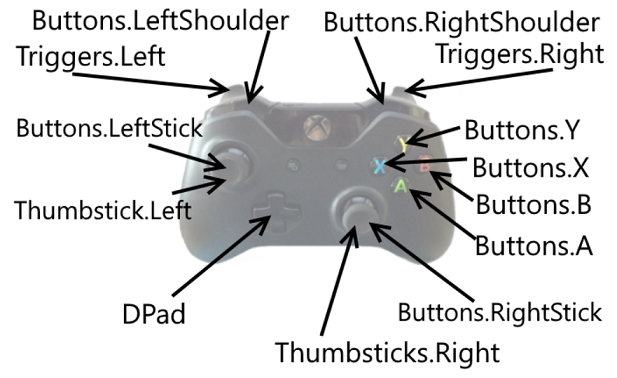
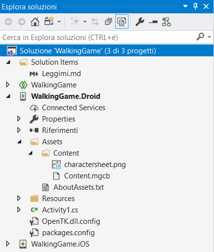
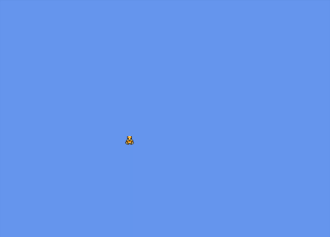
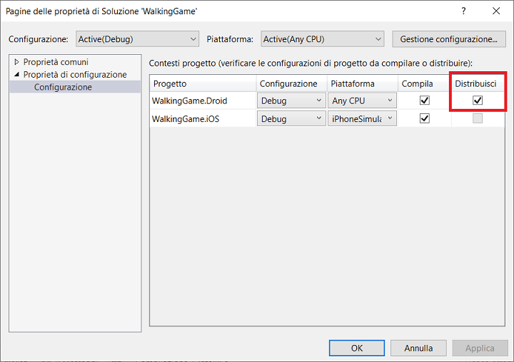

# Framework MonoGame				


## Introduzione

MonoGame è un'API efficiente, flessibile e multipiattaforma per lo sviluppo di giochi 2D e 3D. Fornisce le basi per molti motori di gioco multipiattaforma ma può essere usato direttamente nei giochi senza sottoporre a wrapping in un motore di gioco.

MonoGame è un'API multipiattaforma con accelerazione hardware che fornisce grafica, audio, gestione dello stato del gioco, input e una pipeline di contenuti per l'importazione di asset. Diversamente dalla maggior parte dei motori di gioco, monogame non fornisce né impone alcun modello o struttura del progetto.  Questo significa che i programmatori sono liberi di organizzare il proprio codice come desiderano ma è anche possibile che sia necessario codice d'installazione quando si avvia per la prima volta una nuova soluzione.

 Per un elenco completo delle piattaforme, vedere il [sito Web monogame](http://www.monogame.net/).


## Grafica 3D

L'API MonoGame fornisce una vasta gamma di classi per lo sviluppo di app e giochi 3D. Consente accesso diretto all'H/W per ottenere prestazioni ottimali, mantenendo una sintassi identica in diverse piattaforme.

 MonoGame è quasi identica a Microsoft di XNA, in modo che gli sviluppatori esperti in XNA troveranno MonoGame sviluppo familiari. Gli sviluppatori che non hanno usato XNA, ma che usa DirectX o OpenGL per giochi 3D, troveranno numerose classi e i concetti familiari.

L'API MonogGame include una classe `Model` che può essere usata per archiviare i dati caricati da un file di contenuto e per eseguire il rendering. I file di modello possono essere molto semplici, ad esempio un triangolo a tinta unita, oppure possono includere informazioni per il rendering complesso, tra cui texturing e illuminazione.

Il formato del file XNB è un'estensione standard per il contenuto compilato (contenuto creato dallo [strumento Pipeline monogame](http://www.monogame.net/documentation/?page=Pipeline)). Tutti i contenuti compilati hanno un file di origine (un file con estensione FBX nel caso del modello) e un file di destinazione (un file con estensione XNB). Il formato FBX è un formato di modello 3D comune che può essere creato da applicazioni come [Maya](http://www.autodesk.com/products/maya/overview) e [Blender](http://www.blender.org/).

 La classe `Model` può essere costruita caricando un file con estensione XNB da un disco che contiene dati geometrici 3D.   Il file con estensione XNB è creato tramite un progetto di contenuto. I modelli MonoGame includono automaticamente un progetto di contenuto (con estensione MGCP) nella cartella del contenuto. Per una descrizione dettagliata dello strumento Pipeline MonoGame, vedere la [Guida alla pipeline di contenuti](https://github.com/xamarin/docs-archive/blob/master/Docs/CocosSharp/content-pipeline/introduction.md).

Per  visualizzare il modello sullo schermo aggiungere il codice di caricamento e di disegno. In particolare, saranno svolte le operazioni seguenti.

- Definizione di `Model` un'istanza nella classe `Game1` .
- Caricamento dell'istanza  `Model` in `Game1.LoadContent`
- Disegno dell'istanza  `Model` in `Game1.Draw`


## GamePad

Può essere utilizzato per leggere l'input da input dispositivi su più piattaforme MonoGame. 

###### GamePad in sostituzione per Xbox360GamePad

 L'API XNA originale fornita dlla classe`Xbox360GamePad` per la lettura d'input da un controller di gioco nel PC o Xbox 360. MonoGame è sostituito con una classe `GamePad` poiché i controller Xbox 360 non possono essere usati nella maggior parte delle piattaforme MonoGame (ad esempio, iOS o in Xbox One). Nonostante la modifica del nome, l'utilizzo della classe `GamePad` è simile al `Xbox360GamePad` classe.

######  Lettura d'Input da su GamePad

 La classe `GamePad` fornisce una modalità standardizzata per la lettura d' input su qualsiasi piattaforma MonoGame. Fornisce informazioni sono disponibili due metodi.

1. `GetState` : restituisce lo stato corrente dei pulsanti, bastoncini analogici e di riempimento del controller.
2. `GetCapabilities` : restituisce informazioni sulle funzionalità dell'H/W, per esempio se il controller ha alcuni pulsanti o supporta vibrazione.

```csharp
// in Update, o un codice chiamato ogni fotogramma
var gamePadState = GamePad.GetState(PlayerIndex.One);
// usa gamePadState per spostare il carattere
characterInstance.XVelocity = gamePadState.ThumbSticks.Left.X * characterInstance.MaxSpeed;
characterInstance.YVelocity = gamePadState.ThumbSticks.Left.Y * characterInstance.MaxSpeed;
```

###### Spostamento di un carattere

 Il codice seguente illustra come la chiavetta thumb a sinistra consente di spostare un carattere impostando relativi `XVelocity` e `YVelocity` proprietà. Questo codice si presuppone che `characterInstance` è un'istanza di un oggetto che ha proprietà  `XVelocity` e `YVelocity` .

``` csharp
// In Update, o un codice chiamato ogni frame
var gamePadState = GamePad.GetState(PlayerIndex.One);
// usa gamePadState per spostare il carattere
characterInstance.XVelocity = gamePadState.ThumbSticks.Left.X * characterInstance.MaxSpeed;
characterInstance.YVelocity = gamePadState.ThumbSticks.Left.Y * characterInstance.MaxSpeed;
```

###### Rilevamento di notifiche push

 `GamePadState` fornisce informazioni sullo stato corrente del controller, per esempio se un determinato pulsante è premuto. Determinate azioni, per esempio per rendere un carattere jump, richiedono la verifica se il pulsante è stato eseguito il push (non è stato premuto l'ultimo frame ma non è attivo questo frame) o del rilascio (era premuto l'ultimo frame ma non verso il basso il frame).

 Per eseguire questo tipo di logica, le variabili locali che archiviano i frame precedente `GamePadState` e il frame corrente `GamePadState` dev'essere creato. Nell'esempio seguente è illustrato come archiviare e utilizzare il frame precedente `GamePadState` .

```csharp
// scope della classe:
// memorizza l'ultimo frame e GamePadStates di questo frame 
// "nuovo" in modo che il codice non deve eseguire controlli nulli
GamePadState lastFrameGamePadState = new GamePadState();
GamePadState currentGamePadState = new GamePadState();
protected override void Update(GameTime gameTime)
{
    // memorizzare l'ultimo stato prima di leggere quello nuovo:
    lastFrameGamePadState = currentGamePadState;
    currentGamePadState = GamePad.GetState(PlayerIndex.One);
    bool wasAButtonPushed =
currentGamePadState.Buttons.A == ButtonState.Pressed
        && lastFrameGamePadState.Buttons.A == ButtonState.Released;
    if(wasAButtonPushed)
    {
        MakeCharacterJump();
    }
...
}
```

###### Verifica per i pulsanti

`GetCapabilities` può essere utilizzato per controllare se un controller dispone di H/W specifico, per  esempio un particolare pulsante o un joystick analogico. Il codice seguente illustra come cercare i pulsanti B e Y in un controller in un gioco che richiede la presenza di entrambi i pulsanti.

```csharp
var capabilities = GamePad.GetCapabilities(PlayerIndex.One);
bool hasBButton = capabilities.HasBButton;
bool hasXButton = capabilities.HasXButton;
if(!hasBButton || !hasXButton)
{
    NotifyUserOfMissingButtons();
}
```

Il controller di giochi Xbox One è il dispositivo d'input più comune per Xbox One. Il `GamePad` classe fornisce i valori d'input dall'H/W di gioco.




##  Creazione di un MonoGame multipiattaforma

Monogame consente lo sviluppo di giochi multipiattaforma con grande parte del riutilizzo del codice. Questa procedura dettagliata si concentra sulla configurazione di una soluzione che contiene progetti per iOS e Android, nonché un progetto di codice condiviso per il codice multipiattaforma.

Gioco: l'utente può controllare un carattere animato con input tocco.  Anche se non si tratta tecnicamente di un gioco completo (poiché non presenta condizioni di vittoria o di perdita), illustra diversi concetti di sviluppo di giochi e può essere usato come base per molti tipi di giochi.



 Classi monogame usate nel rendering di base.

- `SpriteBatch`: usato per creare grafica 2D sullo schermo. Gli *sprite* sono elementi visivi 2D utilizzati per visualizzare immagini sullo schermo. L'oggetto  `SpriteBatch` può creare un singolo sprite alla volta tra i relativi metodi  `Begin` e`End` oppure più sprite possono essere raggruppati o in *batch*.
- `Texture2D`: rappresenta un oggetto immagine in fase di esecuzione. Le istanze `Texture2D` sono spesso create da formati di file come PNG o BMP, sebbene possano essere create anche in modo dinamico in fase di esecuzione. Le istanze `Texture2D` sono utilizzate per il rendering con le istanze di  `SpriteBatch` .
- `Vector2`: rappresenta una posizione in un sistema di coordinate 2D usato spesso per posizionare oggetti visivi. Monogame include `Vector3` anche e `Vector4` ma sarà usato `Vector2` solo in questa procedura dettagliata.
- `Rectangle`: area su quattro lati con posizione, larghezza e altezza. Questo sarà usato per definire la parte del `Texture2D` di cui eseguire il rendering quando s'inizia a lavorare con le animazioni.

 Si noti anche che MonoGame non è gestito da Microsoft, nonostante il relativo spazio dei nomi. Lo spazio dei nome `Microsoft.Xna` è usato in MonoGame per semplificare la migrazione di progetti XNA esistenti a MonoGame.

###### Rendering del primo sprite

 Sarà disegnato un singolo sprite sullo schermo per illustrare come eseguire il rendering 2D in MonoGame.

 È necessario creare un'istanza  `Texture2D` da usare quando si esegue il rendering dello sprite. Tutto il contenuto del gioco è in definitiva contenuto in una cartella denominata **Content** che si trova nel progetto specifico della piattaforma. I progetti condivisi MonoGame non possono contenere contenuto, perché il contenuto deve usare azioni di compilazione specifiche della piattaforma. La cartella **Content** si trova all'interno della cartella **assets** nel progetto Android.

 Per aggiungere il contenuto del gioco, fare clic con il pulsante destro del mouse sulla cartella **Content** e scegliere **Aggiungi/Aggiungi  elemento esistente... (MAIUSC+ALT+A)**. Passare al percorso in cui è stato estratto il file content. zip e selezionare il file **charactersheet. png** . Se è richiesto di aggiungere il file alla cartella, è necessario selezionare l'opzione **copia****.

Successivamente, sarà aggiunto il codice per caricare il file charactersheet. png e creare un `Texture2D`. A tale scopo, aprire il file `Game1.cs`  e aggiungere il campo seguente alla classe Game1.cs.

```csharp
Texture2D characterSheetTexture;
```

Successivamente, sarà creato  `characterSheetTexture` nel metodo `LoadContent` . 

```csharp
protected override void LoadContent()
{
    // crea un nuovo SpriteBatch che può essere utilizzato per disegnare le textures
    spriteBatch = new SpriteBatch(GraphicsDevice);
    // utilizzare this.Content per caricare il contenuto del gioco qui
}
```

Si noti che il progetto predefinito crea già un'istanza dell'istanza  `spriteBatch` . Sarà usato in un secondo momento ma non sarà aggiunto altro codice per preparare il per l'uso `spriteBatch` . D'altra parte, `spriteSheetTexture` richiede l'inizializzazione, quindi sarà inizializzata dopo la creazione di: `spriteBatch`

```csharp
protected override void LoadContent()
{
    // crea un nuovo SpriteBatch che può essere utilizzato per disegnare le textures
    spriteBatch = new SpriteBatch(GraphicsDevice);
    using (var stream = TitleContainer.OpenStream ("Content/charactersheet.png"))
    {
        characterSheetTexture = Texture2D.FromStream (this.GraphicsDevice, stream);
    }
}
```

Ora che sono disponibili un'istanza  `SpriteBatch` e un'istanza  `Texture2D`  è possibile aggiungere il codice di rendering al metodo`Game1.Draw` .

```csharp
protected override void Draw(GameTime gameTime)
{
    GraphicsDevice.Clear(Color.CornflowerBlue);
    spriteBatch.Begin ();
    Vector2 topLeftOfSprite = new Vector2 (50, 50);
    Color tintColor = Color.White;
    spriteBatch.Draw(characterSheetTexture, topLeftOfSprite, tintColor);
    spriteBatch.End ();
    base.Draw(gameTime);
}
```

##### Creazione di CharacterEntity

 Finora è stato aggiunto il codice per eseguire il rendering di un singolo sprite sullo schermo. Tuttavia, in caso di sviluppo di un gioco completo senza creare altre classi, si verificano problemi nell'organizzazione del codice.

######  Che cos'è un'entità?

 Un modello comune per organizzare il codice del gioco consiste nel creare una nuova classe per ogni tipo di *entità* di gioco. Un'entità nello sviluppo di giochi è un oggetto che può contenere alcune delle seguenti caratteristiche (non tutte sono obbligatorie).

- Elemento visivo, per esempio uno sprite, un testo o un modello 3D.
- Comportamento fisico o di tutti i frame, per esempio un'unità che sorveglia un percorso set o un carattere del lettore che risponde all'input.
- Può essere creata ed eliminata in modo dinamico, per esempio un'alimentazione che è visualizzata e raccolta dall'utente.

I sistemi di organizzazione di entità possono essere complessi e molti motori di gioco offrono classi per facilitare la gestione delle entità. Sarà implementato un sistema di entità molto semplice, quindi è importante sottolineare che i giochi completi richiedono in genere più organizzazioni per la parte dello sviluppatore.

######  Definizione del CharacterEntity

 L'entità usata nel gioco è  `CharacterEntity` e avrà le caratteristiche seguenti.

- Possibilità di caricare i propri`Texture2D`.
- Possibilità di eseguire il rendering, inclusi i metodi di chiamata per aggiornare l'animazione a distanza.
- `X`e proprietà Y per controllare la posizione del carattere.
- La possibilità di eseguire l'aggiornamento in modo specifico per leggere i valori dal touchscreen e regolare la posizione in modo appropriato.

 Per aggiungere al gioco`CharacterEntity`  fare clic con il pulsante destro del mouse sul progetto ***WalkingGame*** e scegliere ***Aggiungi/Nuovo elemento*** selezionare l'opzione ***Classe*** e denominare il nuovo file *CharacterEntity*, quindi fare clic su **Aggiungi**.

 In primo luogo, si aggiungerà la possibilità  `CharacterEntity` per l'oggetto  `Texture2D` di caricare un oggetto e disegnarlo. Il file appena aggiunto `CharacterEntity.cs` è modificato come segue.

```csharp
using System;
using Microsoft.Xna.Framework.Graphics;
using Microsoft.Xna.Framework;
using Microsoft.Xna.Framework.Input.Touch;


namespace WalkingGame
{
    public class CharacterEntity
    {
        static Texture2D characterSheetTexture;
        public float X
        {
            get;
            set;
        }
        public float Y
        {
            get;
            set;
        }
        public CharacterEntity (GraphicsDevice graphicsDevice)
        {
            if (characterSheetTexture == null)
            {
                using (var stream = TitleContainer.OpenStream ("Content/charactersheet.png"))
                {
                    characterSheetTexture = Texture2D.FromStream (graphicsDevice, stream);
                }
            }
        }
        public void Draw(SpriteBatch spriteBatch)
        {
            Vector2 topLeftOfSprite = new Vector2 (this.X, this.Y);
            Color tintColor = Color.White;
            spriteBatch.Draw(characterSheetTexture, topLeftOfSprite, tintColor);
        }
    }
}
```

Il codice precedente aggiunge la responsabilità del posizionamento, del rendering e del caricamento del contenuto `CharacterEntity`a. 

###### Perché i float X e Y?

I programmatori che non hanno familiarità con la programmazione dei giochi possono chiedersi perché usare il tipo  `float`  . Il motivo è che un valore a 32 bit è più comune per il posizionamento nel codice di rendering di basso livello. Il tipo `Double` occupa 64 bit per la precisione che è raramente necessario per il posizionamento degli oggetti. Anche se una differenza di 32 bit può sembrare irrilevante, molti giochi moderni includono grafici che richiedono l'elaborazione di decine di migliaia di valori di posizione ogni frame (30 o 60 volte al secondo). Ridurre la quantità di memoria che dev'essere spostata attraverso la pipeline grafica può avere un impatto significativo sulle prestazioni di un gioco.

 Il tipo di dati  `int` può essere un'unità di misura appropriata per il posizionamento ma è possibile inserire limitazioni sulla modalità di posizionamento delle entità. Per esempio, l'utilizzo di valori `integer` rende più difficile l'implementazione di Smooth Movement per giochi che supportano lo zoom in o le fotocamere 3D (consentite da `SpriteBatch`).

 Infine, si noterà che la logica che sposta il carattere intorno allo schermo sarà eseguita utilizzando i valori temporali del gioco. Il risultato della moltiplicazione della velocità in base alla quantità di tempo passata in un determinato frame genererà raramente un numero intero, quindi è necessario usare `float` per `X` e `Y`.

###### Perché characterSheetTexture è statico?

L'istanza `Texture2D` è una rappresentazione di runtime del file charactersheet. png. In altre parole, contiene i valori di colore per ogni pixel estratti dal file **charactersheet. png** di origine. Se il gioco fosse creare due istanze `CharacterEntity` , ognuna avrebbe bisogno di accedere alle informazioni di charactersheet. png. In questa situazione non si vuole sostenere il costo delle prestazioni per il caricamento di charactersheet. png due volte, né si vuole avere memoria di trama duplicata archiviata in RAM. L'uso `static` di un campo permette di condividere `Texture2D` lo stesso `CharacterEntity` in tutte le istanze.

 L'uso di membri `static`  per la rappresentazione del contenuto in fase di esecuzione è una soluzione semplicistica e non risolve i problemi riscontrati in giochi più grandi, per esempio lo scaricamento del contenuto quando si passa da un livello ad un altro. Soluzioni più sofisticate  includono l'uso della pipeline di contenuti MonoGame o la creazione di un sistema di gestione dei contenuti personalizzato.

###### Perché SpriteBatch è passato come parametro anziché creare un'istanza dell'entità?

 Il metodo  `Draw` implementato in precedenza accetta un parametro  `SpriteBatch` , `characterSheetTexture` ma al contrario, è creata un'istanza `CharacterEntity`dell'oggetto.

 Il motivo è che il rendering più efficiente è possibile quando è utilizzata la stessa istanza  `SpriteBatch` per tutte `Draw` le chiamate e quando sono effettuate tutte le chiamate `Draw`  tra un singolo set di chiamate  `Begin` e `End` . Naturalmente, il gioco includerà solo una singola istanza di entità ma i giochi più complessi trarranno vantaggio dal modello che consente a più entità di `SpriteBatch` usare la stessa istanza.

###### Aggiunta di CharacterEntity 

 Ora che il codice è stato aggiunto  `CharacterEntity` per il rendering, è possibile sostituire il codice in `Game1.cs` per usare un'istanza della nuova entità. A tale scopo, si sostituirà il campo `Texture2D`  con un camp `CharacterEntity` o `Game1`.

```csharp
public class Game1 : Game
{
    GraphicsDeviceManager graphics;
    SpriteBatch spriteBatch;
    // nuovo codice
    CharacterEntity character;
    public Game1()
    {
    ...
```

Successivamente, si aggiungerà la creazione di un'istanza di questa entità `Game1.Initialize`.

```csharp
protected override void Initialize()
{
    character = new CharacterEntity (this.GraphicsDevice);
    base.Initialize();
}
```

È anche necessario rimuovere la creazione  `Texture2D` da `LoadContent` perché `CharacterEntity`ora è gestita all'interno di. `Game1.LoadContent`.

```csharp
protected override void LoadContent()
{
    // crea un nuovo SpriteBatch che può essere utilizzato per disegnare le textures
    spriteBatch = new SpriteBatch(GraphicsDevice);
}
```

Vale la pena notare che, nonostante il nome, il metodo `LoadContent`  non è l'unica posizione in cui è possibile caricare il contenuto. Molti giochi implementano il caricamento del contenuto nel metodo `Initialize` o anche nel codice di aggiornamento come contenuto, potrebbero non essere necessari finché il giocatore non raggiunge un determinato punto del gioco.

 Infine, è possibile modificare il metodo di estrazione come segue.

```csharp
protected override void Draw(GameTime gameTime)
{
    GraphicsDevice.Clear(Color.CornflowerBlue);
    // inizieremo tutto il nostro disegno qui
    spriteBatch.Begin ();
    // ora possiamo fare qualsiasi rendering di entità:
    character.Draw(spriteBatch);
    // fine: esegue il rendering di tutti gli sprite sullo schermo
    spriteBatch.End ();
    base.Draw(gameTime);
}
```

##### Creazione della classe Animation

 Attualmente è visualizzato il file **charactersheet. png completo.** `CharacterEntity` Questa disposizione di più immagini in un file è definita *foglio sprite*. In genere, uno sprite eseguirà il rendering solo di una parte del foglio sprite. Si modificherà l'oggetto  `CharacterEntity` per eseguire il rendering di una parte di questo **charactersheet. png** e questa parte cambierà nel tempo per visualizzare un'animazione a discesa.

 Si creerà la classe `Animation` per controllare la logica e lo stato dell'animazione `CharacterEntity`. La classe `Animation` sarà una classe generale che può essere usata per qualsiasi entità, non solo `CharacterEntity` per le animazioni. Ultimate la classe `Animation` fornirà un oggetto `Rectangle` che `CharacterEntity` utilizzerà durante il disegno. Sarà anche creata una classe `AnimationFrame` che sarà usata per definire l'animazione.

######  Definizione di AnimationFrame

 `AnimationFrame`non conterrà alcuna logica correlata all'animazione. Sarà usato solo per archiviare i dati. Per aggiungere la classe `AnimationFrame` , fare clic con il pulsante destro del mouse o controllare il progetto condiviso ***WalkingGame*** e selezionare ***Aggiungi/Nuovo elemento*** immettere il nome ***AnimationFrame*** e fare clic sul pulsante ***Aggiungi***. Il file  `AnimationFrame.cs` sarà modificato in modo che contenga il codice seguente.

```csharp
using System;
using Microsoft.Xna.Framework;
namespace WalkingGame
{
    public class AnimationFrame
    {
        public Rectangle SourceRectangle { get; set; }
        public TimeSpan Duration { get; set; }
    }
}
```

La classe `AnimationFrame` contiene due tipi di informazioni.

1. `SourceRectangle`: definisce l'area dell'oggetto `Texture2D` che sarà visualizzata da  `AnimationFrame`. Questo valore è misurato in pixel, con la parte superiore sinistra (0,0).
2. `Duration`: definisce il tempo di visualizzazione  `AnimationFrame` di un oggetto quando è usato in un oggetto `Animation`.

######  Definizione dell'animazione

 La classe `Animation` conterrà un `List<AnimationFrame>` e la logica per cambiare il frame attualmente visualizzato in base al tempo trascorso.

 Per aggiungere la classe `Animation` , fare clic con il pulsante destro del mouse o controllare il progetto condiviso ***WalkingGame*** e selezionare ***Aggiungi/Nuovo elemento*** immettere il nome ***Animation*** , quindi fare clic sul pulsante ***Aggiungi*** . Il file `Animation.cs`  sarà modificato in modo che contenga il codice seguente.

```csharp
using System;
using System.Collections.Generic;
using System.Linq;
using Microsoft.Xna.Framework;

namespace WalkingGame
{
    public class Animation
    {
        List<AnimationFrame> frames = new List<AnimationFrame>();
        TimeSpan timeIntoAnimation;
        TimeSpan Duration
        {
            get
            {
                double totalSeconds = 0;
                foreach (var frame in frames)
                {
                    totalSeconds += frame.Duration.TotalSeconds;
                }
                return TimeSpan.FromSeconds (totalSeconds);
            }
        }

        public void AddFrame(Rectangle rectangle, TimeSpan duration)
        {
            AnimationFrame newFrame = new AnimationFrame()
            {
                SourceRectangle = rectangle,
                Duration = duration
            };
            frames.Add(newFrame);
        }

        public void Update(GameTime gameTime)
        {
            double secondsIntoAnimation = 
                timeIntoAnimation.TotalSeconds + gameTime.ElapsedGameTime.TotalSeconds;
            double remainder = secondsIntoAnimation % Duration.TotalSeconds;
            timeIntoAnimation = TimeSpan.FromSeconds (remainder);
        }
    }
}
```

Esaminiamo alcuni dei dettagli della classe `Animation` .

######  Elenco frame

 Il membro  `frames` è quello che archivia i dati per l'animazione. Il codice che crea un'istanza delle animazioni consente `AnimationFrame` `frames` di aggiungere istanze all'elenco tramite il metodo `AddFrame`.  Un'implementazione più completa può offrire metodi  `public` o proprietà per la modifica `frames` ma le funzionalità per l'aggiunta di frame per questa procedura dettagliata saranno limitate.

######  Duration

Restituisce la durata totale dell' `Animation,` operazione ottenuta aggiungendo la durata di tutte le istanze contenute. `AnimationFrame` Questo valore potrebbe essere memorizzato nella cache `AnimationFrame` se fosse un oggetto non modificabile ma poiché `AnimationFrame` è stato implementato come una classe che può essere modificata dopo essere stata aggiunta all'animazione, è necessario calcolare questo valore ogni volta che è eseguito l'accesso alla proprietà.

######  Aggiorna

 Il metodo `Update` dev'essere chiamato ogni frame (ovvero ogni volta che è aggiornato l'intero gioco). Lo scopo è quello di aumentare il membro `timeIntoAnimation`  usato per restituire il frame attualmente visualizzato. La logica in `Update` impedisce che l'oggetto `timeIntoAnimation`  sia sempre maggiore della durata dell'intera animazione.

 Poiché sarà usata la classe `Animation` per visualizzare un'animazione a lungo termine, si vuole che questa animazione si ripeta quando ha raggiunto la fine. `timeIntoAnimation` È possibile eseguire questa operazione controllando se è maggiore del valore `Duration` . In tal caso, sarà eseguito il ciclo all'inizio e manterrà il resto, ottenendo un'animazione di ciclo.

######  Recupero del rettangolo del frame corrente

 Lo scopo della classe `Animation` è di fornire un oggetto `Rectangle` che può essere usato durante il disegno di uno sprite. Attualmente la classe `Animation` contiene la logica per modificare il membro `timeIntoAnimation`  che sarà usato per ottenere la visualizzazione `Rectangle` . Questa operazione sarà eseguita creando una proprietà  `CurrentRectangle`  nella classe`Animation` . Copiare questa proprietà nella classe `Animation` .

```csharp
        public Rectangle CurrentRectangle
        {
            get
            {
                AnimationFrame currentFrame = null;
                // frame
                TimeSpan accumulatedTime = new TimeSpan(0);
                foreach (var frame in frames)
                {
                    if (accumulatedTime + frame.Duration >= timeIntoAnimation)
                    {
                        currentFrame = frame;
                        break;
                    }
                    else
                        accumulatedTime += frame.Duration;
                }
                /* se non è stato trovato alcun frame, prova l'ultimo fotogramma, nel caso
                 * in cui timeIntoAnimation superi in qualche modo Durata */
                if (currentFrame == null)
                    currentFrame = frames.LastOrDefault();
                /* se abbiamo trovato un frame, restituire il suo rettangolo, altrimenti
                 * restituire un rettangolo vuoto (uno senza larghezza o altezza)  */
                if (currentFrame != null)
                    return currentFrame.SourceRectangle;
                else
                    return Rectangle.Empty;
            }
        }
```

##### Aggiunta della prima animazione a CharacterEntity

 Conterrà le animazioni  `CharacterEntity` per l'esplorazione e la posizione, nonché un riferimento all'oggetto corrente visualizzato `Animation` .

 Prima di tutto, aggiungeremo  `Animation,` il primo da usare per testare la funzionalità . Aggiungere i membri seguenti alla classe `CharacterEntity`.

```csharp
Animation walkDown;
Animation currentAnimation;
```

Definire ora l'animazione `walkDown` . A tale scopo, modificare il costruttore `CharacterEntity`  come segue.

```csharp
public CharacterEntity (GraphicsDevice graphicsDevice)
{
    if (characterSheetTexture == null)
    {
        using (var stream = TitleContainer.OpenStream ("Content/charactersheet.png"))
        {
            characterSheetTexture = Texture2D.FromStream (graphicsDevice, stream);
        }
    }
    walkDown = new Animation ();
    walkDown.AddFrame (new Rectangle (0, 0, 16, 16), TimeSpan.FromSeconds (.25));
    walkDown.AddFrame (new Rectangle (16, 0, 16, 16), TimeSpan.FromSeconds (.25));
    walkDown.AddFrame (new Rectangle (0, 0, 16, 16), TimeSpan.FromSeconds (.25));
    walkDown.AddFrame (new Rectangle (32, 0, 16, 16), TimeSpan.FromSeconds (.25));
}
```

Come indicato in precedenza, è necessario chiamare `Animation.Update` per riprodurre le animazioni basate sul tempo. È anche necessario assegnare `currentAnimation`. Per il momento sarà assegnato a `currentAnimation` , `walkDown`ma il codice sarà sostituito in un secondo momento quando s'implementerà la logica di movimento. Aggiungeremo il metodo  `Update` a `CharacterEntity` come indicato di seguito.

```csharp
public void Update(GameTime gameTime)
{
    // temporaneo - sostituiremo questo con la logica basata su quale modo il
    // carattere si muove quando aggiungiamo logica di movimento
    currentAnimation = walkDown;
    currentAnimation.Update (gameTime);
}
```

Ora che è stata assegnata e aggiornata, è possibile usarla per eseguire il disegno `currentAnimation` . Sarà modificato `CharacterEntity.Draw` come segue.

```csharp
public void Draw(SpriteBatch spriteBatch)
{
    Vector2 topLeftOfSprite = new Vector2 (this.X, this.Y);
    Color tintColor = Color.White;
    var sourceRectangle = currentAnimation.CurrentRectangle;
    spriteBatch.Draw(characterSheetTexture, topLeftOfSprite, sourceRectangle, Color.White);
}
```

L'ultimo passaggio per ottenere l'animazione  `CharacterEntity` consiste nel chiamare il metodo appena aggiunto `Update` da `Game1`. Modificare `Game1.Update` come segue.

```csharp
protected override void Update(GameTime gameTime)
{
    character.Update (gameTime);
    base.Update(gameTime);
}
```

##### Aggiunta dello spostamento al carattere

 Successivamente, si aggiungerà lo spostamento al carattere usando i controlli touch. Quando l'utente tocca lo schermo, il carattere si sposta verso il punto in cui è toccato lo schermo. Se non sono rilevati tocchi, il carattere sarà inserito.

 Definizione di GetDesiredVelocityFromInput

 Sarà usata la classe MonoGame `TouchPanel`  che fornisce informazioni sullo stato corrente del touchscreen. Si aggiungerà un metodo che verificherà e `TouchPanel` restituirà la velocità desiderata per il carattere.

```csharp
Vector2 GetDesiredVelocityFromInput()
{
    Vector2 desiredVelocity = new Vector2 ();
    TouchCollection touchCollection = TouchPanel.GetState();
    if (touchCollection.Count > 0)
    {
        desiredVelocity.X = touchCollection [0].Position.X - this.X;
        desiredVelocity.Y = touchCollection [0].Position.Y - this.Y;
        if (desiredVelocity.X != 0 || desiredVelocity.Y != 0)
        {
            desiredVelocity.Normalize();
            const float desiredSpeed = 200;
            desiredVelocity *= desiredSpeed;
        }
    }
    return desiredVelocity;
}
```

Il metodo  `TouchPanel.GetState` restituisce un oggetto `TouchCollection` che contiene informazioni sulla posizione in cui l'utente tocca lo schermo. Se l'utente non tocca lo schermo, `TouchCollection` sarà vuoto, nel qual caso non è necessario spostare il carattere.

 Se l'utente tocca lo schermo, il carattere sarà spostato verso il primo tocco, in altre parole, `TouchLocation` in corrispondenza dell'indice 0. Inizialmente la velocità desiderata sarà impostata in modo da corrispondere alla differenza tra la posizione del carattere e la posizione del primo tocco.

```csharp
desiredVelocity.X = touchCollection [0].Position.X - this.X;
desiredVelocity.Y = touchCollection [0].Position.Y - this.Y;
```

Di seguito sono riportati calcoli matematici che manterranno il carattere che si muove alla stessa velocità. Per spiegare il motivo per cui questo aspetto è importante, si consideri una situazione in cui l'utente sta toccando la schermata 500 pixel a partire dal punto in cui si trova il carattere. La prima riga in `desiredVelocity.X` cui è impostato assegna un valore di 500. Tuttavia, se l'utente tocca lo schermo ad una distanza di soli 100 unità dal carattere, `desiredVelocity.X` è impostato su 100. Il risultato sarebbe che la velocità di spostamento del carattere risponderebbe alla distanza del punto di tocco dal carattere. Poiché si vuole che il carattere si sposti sempre alla stessa velocità, è necessario modificare il `desiredVelocity`.

 L'istruzione  `if (desiredVelocity.X != 0 || desiredVelocity.Y != 0)` sta verificando se la velocità è diversa da zero. in altre parole, verifica che l'utente non tocchi lo stesso punto della posizione corrente del carattere. In caso contrario, è necessario impostare la velocità del carattere in modo che sia costante indipendentemente dalla distanza del tocco. Questa operazione è eseguita normalizzando il vettore di velocità che restituisce una lunghezza pari a 1. Un vettore di velocità pari a 1 indica che il carattere è spostato a 1 pixel al secondo. Questa operazione sarà velocizzata moltiplicando il valore per la velocità desiderata di 200.

##### Applicazione della velocità alla posizione

La velocità restituita da `GetDesiredVelocityFromInput` dev'essere applicata ai valori `X` e `Y` del carattere per avere un effetto in fase di esecuzione. Il metodo  `Update` sarà modificato come segue.

```csharp
public void Update(GameTime gameTime)
{
    var velocity = GetDesiredVelocityFromInput ();
    this.X += velocity.X * (float)gameTime.ElapsedGameTime.TotalSeconds;
    this.Y += velocity.Y * (float)gameTime.ElapsedGameTime.TotalSeconds;
    // temporaneo - sostituiremo questo con la logica basata su quale modo il
    // carattere si muove quando aggiungiamo logica di movimento
    currentAnimation = walkDown;
    currentAnimation.Update (gameTime);
}
```

Ciò implementato è denominato spostamento *basato sul tempo* (anziché spostamento *basato su frame* ). Lo spostamento basato sul tempo moltiplica un valore di velocità (in questo caso i valori archiviati nella variabile  `velocity` variabile) in base al tempo trascorso dall'ultimo aggiornamento archiviato in  `gameTime.ElapsedGameTime.TotalSeconds` Se il gioco è eseguito in un minor numero di fotogrammi al secondo, il tempo trascorso tra i frame aumenta: il risultato finale è che gli oggetti che usano lo spostamento basato sul tempo si sposteranno sempre alla stessa velocità indipendentemente dalla frequenza dei fotogrammi.

 Se si esegue il gioco adesso, si noterà che il carattere sta per passare alla posizione del tocco.

##### Spostamento e animazione corrispondenti

 Quando il carattere si sposta e si riproduce un'unica animazione, è possibile definire il resto delle animazioni, quindi usarle per riflettere lo spostamento del carattere. Al termine, si avranno in totale otto animazioni.

- Animazioni per le attività a discesa, a sinistra e a destra.
- Animazioni per l'esecuzione ancora e la rivolta verso l'alto, verso il basso, verso sinistra e verso destra.

#####  Definizione delle altre animazioni

Per prima cosa `Animation` saranno aggiunte le istanze alla classe `CharacterEntity`  per tutte le animazioni nella stessa posizione in cui è stato aggiunto `walkDown`. Una volta eseguita questa operazione, `CharacterEntity` avrà i membri seguenti `Animation` .

```csharp
Animation walkDown;
Animation walkUp;
Animation walkLeft;
Animation walkRight;
Animation standDown;
Animation standUp;
Animation standLeft;
Animation standRight;
Animation currentAnimation;
```

A questo punto saranno definite le animazioni nel costruttore `CharacterEntity` , come indicato di seguito.

```csharp
        public CharacterEntity(GraphicsDevice graphicsDevice)
        {
            if (characterSheetTexture == null)
            {
                using (var stream = TitleContainer.OpenStream("Content/charactersheet.png"))
                {
                    characterSheetTexture = Texture2D.FromStream(graphicsDevice, stream);
                }
            }
            walkDown = new Animation();
            walkDown.AddFrame(new Rectangle(0, 0, 16, 16), TimeSpan.FromSeconds(.25));
            walkDown.AddFrame(new Rectangle(16, 0, 16, 16), TimeSpan.FromSeconds(.25));
            walkDown.AddFrame(new Rectangle(0, 0, 16, 16), TimeSpan.FromSeconds(.25));
            walkDown.AddFrame(new Rectangle(32, 0, 16, 16), TimeSpan.FromSeconds(.25));
            walkUp = new Animation();
            walkUp.AddFrame(new Rectangle(144, 0, 16, 16), TimeSpan.FromSeconds(.25));
            walkUp.AddFrame(new Rectangle(160, 0, 16, 16), TimeSpan.FromSeconds(.25));
            walkUp.AddFrame(new Rectangle(144, 0, 16, 16), TimeSpan.FromSeconds(.25));
            walkUp.AddFrame(new Rectangle(176, 0, 16, 16), TimeSpan.FromSeconds(.25));
            walkLeft = new Animation();
            walkLeft.AddFrame(new Rectangle(48, 0, 16, 16), TimeSpan.FromSeconds(.25));
            walkLeft.AddFrame(new Rectangle(64, 0, 16, 16), TimeSpan.FromSeconds(.25));
            walkLeft.AddFrame(new Rectangle(48, 0, 16, 16), TimeSpan.FromSeconds(.25));
            walkLeft.AddFrame(new Rectangle(80, 0, 16, 16), TimeSpan.FromSeconds(.25));
            walkRight = new Animation();
            walkRight.AddFrame(new Rectangle(96, 0, 16, 16), TimeSpan.FromSeconds(.25));
            walkRight.AddFrame(new Rectangle(112, 0, 16, 16), TimeSpan.FromSeconds(.25));
            walkRight.AddFrame(new Rectangle(96, 0, 16, 16), TimeSpan.FromSeconds(.25));
            walkRight.AddFrame(new Rectangle(128, 0, 16, 16), TimeSpan.FromSeconds(.25));
            // le animazioni permanenti hanno un solo frame di animazione
            standDown = new Animation();
            standDown.AddFrame(new Rectangle(0, 0, 16, 16), TimeSpan.FromSeconds(.25));
            standUp = new Animation();
            standUp.AddFrame(new Rectangle(144, 0, 16, 16), TimeSpan.FromSeconds(.25));
            standLeft = new Animation();
            standLeft.AddFrame(new Rectangle(48, 0, 16, 16), TimeSpan.FromSeconds(.25));
            standRight = new Animation();
            standRight.AddFrame(new Rectangle(96, 0, 16, 16), TimeSpan.FromSeconds(.25));
        }

```

Si noti che il codice precedente è stato aggiunto al costruttore  `CharacterEntity` per tenere più breve questa procedura dettagliata. I giochi in genere separano la definizione delle animazioni di caratteri nelle rispettive classi o caricano queste informazioni da un formato dati, ad esempio **XML** (*eXtensible Markup Language*)  o **JSON** (*JavaScript Object Notation*).

 Successivamente, si modificherà la logica per usare le animazioni in base alla direzione in cui il carattere è in corso di trasferimento o in base all'ultima animazione se il carattere è stato appena interrotto. A tale scopo, si modificherà il metodo `Update` .

```csharp
        public void Update(GameTime gameTime)
        {
            var velocity = GetDesiredVelocityFromInput();
            this.X += velocity.X * (float)gameTime.ElapsedGameTime.TotalSeconds;
            this.Y += velocity.Y * (float)gameTime.ElapsedGameTime.TotalSeconds;
            // la variabile velocità determina se il carattere si muove o si sta fermando
            bool isMoving = velocity != Vector2.Zero;
            if (isMoving)
            {
                /* se il valore assoluto del componente X è maggiore del valore assoluto
                 * della componente Y, allora questo significa che il carattere si sta
                 * muovendo orizzontalmente */
                bool isMovingHorizontally = Math.Abs(velocity.X) > Math.Abs(velocity.Y);
                if (isMovingHorizontally)
                {
                  /* non  sappiamo se il carattere si muove orizzontalmente
                   * possiamo verificare se la velocità è positiva (muovendosi a destra)
                   * o negativa (spostamento a sinistra) */
                    if (velocity.X > 0)
                        currentAnimation = walkRight;
                    else
                        currentAnimation = walkLeft;
                }
                else
                {
               /* se il carattere non si muove orizzontalmente allora deve muoversi
                * verticalmente, la classe SpriteBatch tratta positiva Y come giù, quindi
                * questo definisce il sistema di coordinate per il gioco, pertanto, se Y
                * è positivo, quindi il carattere si muove verso il basso, in caso
                * contrario, il carattere si sta spostando verso l'alto  */
                    if (velocity.Y > 0)
                        currentAnimation = walkDown;
                    else
                        currentAnimation = walkUp;
                }
            }
            else
            {
            /* questa istruzione else contiene la logica per il carattere, in primo luogo
             * ci accingiamo a controllare se il carattere sta attualmente
             * riproducendo tutte le animazioni a piedi, se è così, allora vogliamo
             * passare ad un'animazione permanente, vogliamo preservare la
             * direzione in cui il carattere è rivolto verso di noi in modo da
             * impostare la posizione corrispondente l'animazione in base
             * all'animazione a piedi riprodotta */
                if (currentAnimation == walkRight)
                    currentAnimation = standRight;
                else if (currentAnimation == walkLeft)
                    currentAnimation = standLeft;
                else if (currentAnimation == walkUp)
                    currentAnimation = standUp;
                else if (currentAnimation == walkDown)
                    currentAnimation = standDown;
                // se il carattere è fermo ma non mostra alcuna animazione, allora avremo di default la fronte verso il basso
                else if (currentAnimation == null)
                    currentAnimation = standDown;
            }
            currentAnimation.Update(gameTime);
        }

```

Il codice per cambiare le animazioni è suddiviso in due blocchi. Il primo controlla se la velocità non è uguale a `Vector2.Zero` : indica se il carattere è in continua evoluzione. Se il carattere è in fase di trasferimento, è possibile esaminare `velocity.X` i valori  `velocity.Y` per determinare quale animazione a piedi riprodurre.

 Se il carattere non è spostato, è necessario impostare il carattere `currentAnimation` su un'animazione in piedi ma solo `currentAnimation` se è un'animazione a camminamento o se un'animazione non è stata impostata. Se non `currentAnimation`è una delle quattro animazioni a breve, il carattere è già in esecuzione, quindi non è necessario modificarlo. `currentAnimation`

 Il risultato di questo codice è che il carattere è animato correttamente quando si cammina, quindi si trova l'ultima direzione  cui si è camminato quando si arresta.




Per usare il dispositivo smartphone, fare tap su **Impostazioni/Opzioni sviluppatore**, segno di spunta su **Debug USB**.

 Fare clic destro sulla soluzione in Visual Studio e selezionare la voce ***Proprietà***. Segno di spunta sulla voce ***Distribuisci***.




