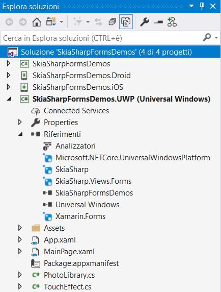
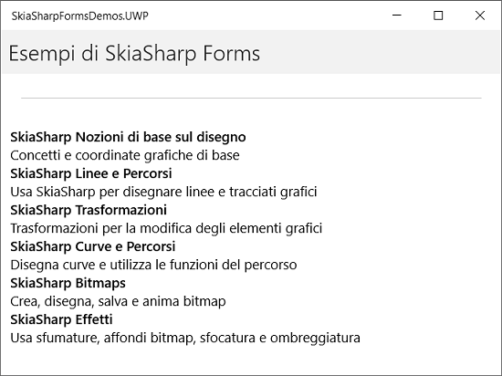

# Framework SkiaSharp				

## Introduzione

SkiaSharp è un sistema di grafica 2D per .NET e con tecnologia C#,  il motore della grafica Skia è open source ed è ampiamente usato nei prodotti di Google. È possibile usare SkiaSharp nelle app Xamarin.Forms per disegnare il testo, bitmap e la grafica vettoriale 2D. 

## Operazioni preliminari di SkiaSharp

SkiaSharp per Xamarin.Forms è fornito come un pacchetto NuGet. Dopo aver creato una soluzione xamarin.Forms in Visual Studio o Visual Studio per Mac, è possibile usare Gestione pacchetti NuGet cercare il **SkiaSharp.Views.Forms** del pacchetto e aggiungerlo alla soluzione. 

Se l'app xamarin.Forms è destinata a iOS, usare la pagina delle proprietà di progetto per modificare la destinazione di distribuzione minima a iOS 8.0.

In qualsiasi pagina di C# che utilizza SkiaSharp è opportuno includere una direttiva `using` per lo spazio dei nomi [`SkiaSharp` ](https://docs.microsoft.com/it-it/dotnet/api/skiasharp) che comprenda tutte le classi i SkiaSharp , strutture ed enumerazioni che saranno usate negli elementi grafici per la programmazione. Sarà inoltre necessario una direttiva `using` per lo spazio dei nomi [`SkiaSharp.Views.Forms` per le classi specifiche di xamarin.Forms.  Questa classe deriva dalla classe xamarin.Forms `View` e ospita l'output dei grafici SkiaSharp.

lo spazio dei nom `SkiaSharp.Views.Forms` contiene inoltre una classe `SKGLView` che deriva da `View` ma usa OpenGL per il rendering grafica. 

## [Nozioni di base sul disegno con SkiaSharp](https://docs.microsoft.com/it-it/xamarin/xamarin-forms/user-interface/graphics/skiasharp/basics/index)

Alcune delle figure di grafica più semplice che è possibile disegnare con SkiaSharp sono cerchi, ovali e rettangoli. La visualizzazione di testo e bitmap è più complessa, ma questi articoli introducono anche queste tecniche.

## [Linee e tracciati in SkiaSharp](https://docs.microsoft.com/it-it/xamarin/xamarin-forms/user-interface/graphics/skiasharp/paths/index)

Un percorso della grafica è una serie di curve e linee rette collegate. I percorsi possono essere tracciati, riempiti o entrambi. 

## [Trasformazioni di SkiaSharp](https://docs.microsoft.com/it-it/xamarin/xamarin-forms/user-interface/graphics/skiasharp/transforms/index)

Le trasformazioni consentono agli oggetti di grafica in modo uniforme convertito, ridimensionato, ruotato o asimmetrici. 

## [Curve e tracciati in SkiaSharp](https://docs.microsoft.com/it-it/xamarin/xamarin-forms/user-interface/graphics/skiasharp/curves/index)

Aggiunta di curve agli oggetti percorso, è possibile specificare un percorso completo nella stringa di testo conciso, come utilizzare effetti per il tracciato e come approfondire meccanismi interni di percorso.

## [Bitmap SkiaSharp](https://docs.microsoft.com/it-it/xamarin/xamarin-forms/user-interface/graphics/skiasharp/bitmaps/index)

Le bitmap sono matrici rettangolari di bit corrispondente per il pixel di un dispositivo di visualizzazione. 

## [Effetti di SkiaSharp](https://docs.microsoft.com/it-it/xamarin/xamarin-forms/user-interface/graphics/skiasharp/effects/index)

Gli effetti sono proprietà modificare la visualizzazione di grafica, incluse le sfumature lineari e circolari normali, bitmap per l'affiancamento, blend modalità, blur e ad altri utenti.

## Creazione di uno SkiaSharp multipiattaforma

SkiaSharp consente lo sviluppo di giochi multipiattaforma con grande parte del riutilizzo del codice. Questa procedura dettagliata si concentra sulla configurazione di una soluzione che contiene progetti per iOS e Android, nonché un progetto di codice condiviso per il codice multipiattaforma.

 A questo punto è possibile compilare, distribuire e avviare l'app Xamarin.Forms per verificarne l'aspetto.

1. Nella barra degli strumenti di Visual Studio fare clic con il pulsante destro del mouse sul progetto e selezionare ***Imposta come progetto di avvio***.
2. Fare clic sulla voce di menu ***Debug/Avvia debug (F5)***  o il pulsante di riproduzione (include il testo **Computer locale**) per avviare l'app nel PC locale.

