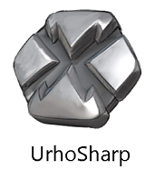
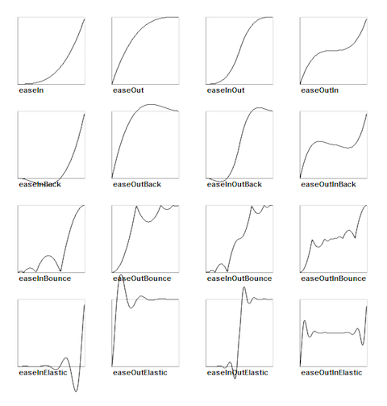
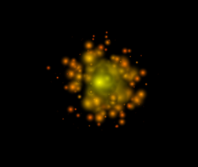
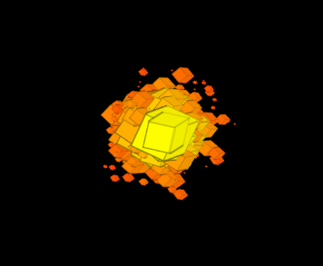

# UrhoSharp - 3D/2D Engin			




UrhoSharp è un motore multipiattaforma ad alto livello 2D e 3D che può essere utilizzato per creare scene 2D e 3D animate per le app che usano le geometrie, materiali, luci e fotocamere digitali.


## Struttura di base

 Il gioco dev'essere una sotto classe della classe  `Application` , s'installa con il metodo `Setup`  e si avvia  con il metodo `Start` .  Quindi occorre costruire l'UI principale.  

```csharp
class MySample : Application {
    protected override void Start ()
    {
        CreateScene ();
        Input.KeyDown += (args) => {
            if (args.Key == Key.Esc) Exit ();
        };
    }

    async void CreateScene()
    {
        // testo UI 
        var helloText = new Text()
        {
            Value = "Hello World",HorizontalAlignment = HorizontalAlignment.Center,
            VerticalAlignment = VerticalAlignment.Center
        };
        helloText.SetColor(new Color(0f, 1f, 1f));
        helloText.SetFont(
            font: ResourceCache.GetFont("Fonts/Font.ttf"),
            size: 30);
        UI.Root.AddChild(helloText);

        // per creare una scena di primo livello, è necessario aggiungere Octree per 
        // visualizzare qualsiasi contenuto 3D
        var scene = new Scene();
        scene.CreateComponent<Octree>();
        // Box
        Node boxNode = scene.CreateChild();
        boxNode.Position = new Vector3(0, 0, 5);
        boxNode.Rotation = new Quaternion(60, 0, 30);
        boxNode.SetScale(0f);
        StaticModel modelObject = boxNode.CreateComponent<StaticModel>();
        modelObject.Model = ResourceCache.GetModel("Models/Box.mdl");
        // Luce
        Node lightNode = scene.CreateChild(name: "light");
        lightNode.SetDirection(new Vector3(0.6f, -1.0f, 0.8f));
        lightNode.CreateComponent<Light>();
        // Camera
        Node cameraNode = scene.CreateChild(name: "camera");
        Camera camera = cameraNode.CreateComponent<Camera>();
        // Finestra
        Renderer.SetViewport(0, new Viewport(scene, camera, null));
        // Eseguire alcune azioni
        await boxNode.RunActionsAsync(
            new EaseBounceOut(new ScaleTo(duration: 1f, scale: 1)));
        await boxNode.RunActionsAsync(
            new RepeatForever(new RotateBy(duration: 1,
                deltaAngleX: 90, deltaAngleY: 0, deltaAngleZ: 0)));
     }
}
```

Se si esegue quest'app, si scoprirà che la fase di esecuzione del reclamo gli asset non sono presenti.  È quindi necessario impostare nelle proprietà dell'elemento per ogni asset "Copia di Directory di Output" per "Copia se più recente" che garantisce che i dati siano presenti.

Per avviare l'app si chiama la funzione d'inizializzazione del motore, seguita dalla creazione di una nuova istanza della classe dell'app, simile al seguente.

```csharp
new MySample().Run();
```

Il runtime richiama i metodi `Setup` e `Start` per l'utente.  Se esegue l'override `Setup` è possibile configurare i parametri del motore.

 È necessario eseguire l'override `Start` , in questo metodo si caricheranno gli asset, connettere i gestori eventi, la scena d'installazione e avviare tutte le azioni che si desiderano.  

Il seguente frammento di codice usa il framework dell'UI per creare un elemento di testo e aggiungerlo alla gioco.

```csharp
// testo UI 
var helloText = new Text()
{
    Value = "Hello World da UrhoSharp",
    HorizontalAlignment = HorizontalAlignment.Center,
    VerticalAlignment = VerticalAlignment.Center
};
helloText.SetColor(new Color(0f, 1f, 1f));
helloText.SetFont(
    font: ResourceCache.GetFont("Fonts/Font.ttf"),
    size: 30);
UI.Root.AddChild(helloText);
```

Il framework dell'UI è presente per fornire un'UI all'interno del gioco molto semplice e funziona mediante l'aggiunta di nuovi nodi per il `UI.Root` nodo.

 Seconda parte: configurazione di esempio della scena principale.  Ciò comporta una serie di passaggi, la creazione di una scena 3D, la creazione di una casella 3D nella schermata di aggiunta di una luce, una videocamera e un riquadro di visualizzazione.  Questi sono presi in esame in modo più dettagliato nella sezione [scena, nodi, i componenti e fotocamere](https://docs.microsoft.com/it-it/xamarin/graphics-games/urhosharp/using#scenenodescomponentsandcameras).

 Terza parte dell'esempio attiva un paio di azioni.  Le azioni sono ricette che descrivono un effetto specifico e dopo la creazione possono essere eseguite da un nodo su richiesta chiamando il `RunActionAsync` metodo su un `Node`.

 La prima azione ridimensiona la finestra con un effetto di rimbalzo e il secondo ruota la casella per sempre.

```csharp
var recipe = new EaseBounceOut(new ScaleTo(duration: 1f, scale: 1));
```

Dopo aver creato il file recipe, eseguiamo il file recipe.

```csharp
await boxNode.RunActionsAsync (recipe)
```

Await indica che si dovrà riprendere l'esecuzione al termine di questa riga al termine dell'operazione.  Una volta completata l'azione è attiva la seconda animazione.


## Scene, nodi, componenti e videocamere

 Il modello di scena può essere descritto come un grafico della scena in base al componente. La scena è costituito da una gerarchia di nodi della scena, a partire dal nodo radice che rappresenta anche l'intera scena. Ogni `Node` dispone di una trasformazione 3D (posizione, scala e rotazione), un nome, un ID, oltre a un numero arbitrario di componenti.  Componenti che rendono possibile aggiungere una rappresentazione visiva (`StaticModel`), possono generare file audio (`SoundSource`), forniscono un limite di conflitto e così via.

 È possibile creare scene e nodi di programma d'installazione tramite il [Urho Editor](https://docs.microsoft.com/it-it/xamarin/graphics-games/urhosharp/using#urhoeditor), oppure è possibile eseguire operazioni dal codice C#.  

 Oltre a configurare la scena, è necessario configurare una `Camera`, questo è ciò che determina ciò che sarà visualizzato all'utente.

##### Configurazione 

```csharp
var scene = new Scene ();
// crea il componente Octree nella scena. Questo è necessario prima dell'aggiunta di 
// componenti drawable, altrimenti non sarà visualizzato nulla. Il volume di octree 
/7 predefinito sarà compreso tra -1000, -1000, -1000) e (1000, 1000, 1000) in world 
// coordinates; è anche legale mettere oggetti al di fuori del volume ma la loro 
// visibilità non può quindi essere in modo gerarchico ottimizzata 
scene.CreateComponent<Octree> ();
// crea un nodo di scena figlio (all'origine globale) e un StaticModel
// componente in esso. Impostare StaticModel per visualizzare una semplice mesh del piano
// con un materiale "stone". Si noti che la denominazione dei nodi della scena è
// facoltativo. Aumentare le dimensioni del nodo della scena (100 x 100 world units)
var planeNode = scene.CreateChild("Plane");
planeNode.Scale = new Vector3 (100, 1, 100);
var planeObject = planeNode.CreateComponent<StaticModel> ();
planeObject.Model = ResourceCache.GetModel ("Models/Plane.mdl");
planeObject.SetMaterial(ResourceCache.GetMaterial("Materials/StoneTiled.xml"));
```

##### Componenti

 Il rendering di oggetti 3D, la riproduzione audio, fisica e logica di script aggiornamenti tutti abilitata per la creazione di componenti diversi nei nodi chiamando `CreateComponent<T>()`.  Ad esempio, configurare il nodo e dei componenti leggeri simile al seguente.

```csharp
// crea una luce direzionale verso il mondo in modo che possiamo vedere qualcosa. 
// L'orientamento del nodo della scena luminosa controlla la direzione della luce; 
// useremo la funzione SetDirection che calcola l'orientamento da un vettore di 
// direzione. La luce utilizzerà le impostazioni predefinite (luce bianca, senza ombre)
var lightNode = scene.CreateChild("DirectionalLight");
lightNode.SetDirection (new Vector3(0.6f, -1.0f, 0.8f));
```

È stata creata di sopra di un nodo con il nome "`DirectionalLight`" e imposta una direzione ma alcun altro elemento.  È possibile tornare a questo punto, il nodo precedente in un nodo illuminante, collegando un `Light` componente, con `CreateComponent`.

```csharp
var light = lightNode.CreateComponent<Light>();
```

##### Fotocamere 

 Esattamente come la luce, fotocamere sono componenti, pertanto sarà necessario collegare il componente ad un nodo, simile al seguente.

```csharp
var CameraNode = scene.CreateChild ("camera");
camera = CameraNode.CreateComponent<Camera>();
CameraNode.Position = new Vector3 (0, 5, 0);
```

Con questa impostazione, aver creato una fotocamera e inseriti la fotocamera nel mondo 3D, il passaggio successivo consiste nel comunicare ad `Application` che si tratta della fotocamera che si desidera utilizzare, questa operazione è eseguita con il codice seguente.

```csharp
Renderer.SetViewPort (0, new Viewport (Context, scene, camera, null))
```

##### Identificazione 

 A differenza dei nodi, i componenti non hanno nomi; i componenti all'interno dello stesso nodo sono identificati solo per il tipo e indice nell'elenco dei componenti del nodo che è compilato in ordine di creazione, ad esempio, è possibile recuperare il `Light` componente fuori il `lightNode` di sopra dell'oggetto simile al seguente.

```csharp
var myLight = lightNode.GetComponent<Light>();
```

È anche possibile ottenere un elenco di tutti i componenti recuperando il `Components` che restituisce un `IList<Component>`.

##### Azioni

 È possibile aggiungere il comportamento ai nodi molto facilmente usando le azioni.  Le azioni possono modificare varie proprietà del nodo ed eseguirle in un periodo di tempo o ripeterle un numero di volte con una curva di animazione specifica.

 Si consideri ad esempio un nodo `cloud` nella scena, eseguire una dissolvenza simile al seguente.

```csharp
await cloud.RunActionsAsync (new FadeOut (duration: 3))
```

Le azioni sono oggetti non modificabili, in pratica è possibile riutilizzare l'azione per l'attivazione di oggetti diversi.

 Un idioma comune consiste nel creare un'azione che esegue l'operazione inversa.

```csharp
var gotoExit = new MoveTo (duration: 3, position: exitLocation);
var return = gotoExit.Reverse ();
```

Nell'esempio seguente l'oggetto si dissolve in un periodo di tre secondi.  È anche possibile eseguire un'azione dopo l'altra, per esempio, è possibile innanzitutto spostare nel `cloud` e quindi nasconderlo.

```csharp
await cloud.RunActionsAsync (
    new MoveBy  (duration: 1.5f, position: new Vector3(0, 0, 15),
    new FadeOut (duration: 3));
```

Se si desidera eseguire sul posto allo stesso tempo entrambe le azioni , è possibile usare l'azione parallela.

```csharp
await cloud.RunActionsAsync (
    new Parallel (
      new MoveBy  (duration: 3, position: new Vector3(0, 0, 15),
      new FadeOut (duration: 3)));
```

 Queste sono le azioni di base supportate di UrhoSharp.

- Lo spostamento dei nodi: `MoveTo`, `MoveBy`, `Place`, `BezierTo`, `BezierBy`, `JumpTo`, `JumpBy`
- La rotazione dei nodi: `RotateTo`, `RotateBy`
- Il ridimensionamento dei nodi: `ScaleTo`, `ScaleBy`
- La dissolvenza dei nodi: `FadeIn`, `FadeTo`, `FadeOut`, `Hide`, `Blink`
- Tinte: `TintTo`, `TintBy`
- Istanti: `Hide`, `Show`, `Place`, `RemoveSelf`, `ToggleVisibility`
- Looping: `Repeat`, `RepeatForever`, `ReverseTime`

 Altre funzionalità avanzate includono la combinazione delle azioni `Spawn` e `Sequence` .

##### Interpolazione 

 Per impostazione predefinita le azioni avranno un comportamento lineare, per esempio un'azione `MoveTo` ha uno spostamento robotico.  È possibile eseguire il wrapping di azioni in un'azione d'interpolazione per modificare il comportamento, per esempio, più lentamente iniziare lo spostamento, accelerare e lentamente raggiunge la fine (`EasyInOut`).

Eseguire questa operazione eseguendo il wrapping di un'azione esistente in un'azione d'interpolazione, ad esempio.

```csharp
await cloud.RunActionAsync (
   new EaseInOut (
     new MoveTo (duration: 3, position: new Vector (0,0,15)), rate:1))
```

Esistono molte modalità d'interpolazione, il grafico seguente illustra i vari tipi d'interpolazione e il relativo comportamento sul valore dell'oggetto che controlla il periodo di tempo, dall'inizio alla fine.



##### Comportamenti 

 Se si desidera controllare il comportamento del componente in base a ciascun frame singolarmente invece di usare le azioni, l'operazione consiste nel sostituire il metodo `OnUpdate` della sotto classe `Component` .  Questo metodo è richiamato una volta per ogni fotogramma ed è richiamato solo se s'imposta la proprietà `ReceiveSceneUpdates` su true.

 Di seguito è illustrato come creare un `Rotator` componente che è quindi collegato ad un nodo.

```csharp
class Rotator : Component {
    public Rotator()
    {
        ReceiveSceneUpdates = true;
    }
    public Vector3 RotationSpeed { get; set; }
    protected override void OnUpdate(float timeStep)
    {
        Node.Rotate(new Quaternion(
            RotationSpeed.X  timeStep,
            RotationSpeed.Y  timeStep,
            RotationSpeed.Z  timeStep),
            TransformSpace.Local);
    }
}
```

Associare questo componente ad un nodo.

```csharp
Node boxNode = new Node();
var rotator = new Rotator() { RotationSpeed = rotationSpeed };
boxNode.AddComponent (rotator);
```

##### Combinazione degli stili

 È possibile usare il modello basato su async/azione per la programmazione di gran parte del comportamento che è ideale per lo stile fire-and-forget della programmazione ma è possibile anche ottimizzare il comportamento del componente per l'esecuzione con un codice di aggiornamento in ogni fotogramma.

 Ad esempio, nel gioco è utilizzata la classe`Enemy` che consente di codificare le azioni del comportamento di base ma garantisce anche che i componenti puntino verso l'utente tramite l'impostazione della direzione del nodo con `Node.LookAt`.

```csharp
protected override void OnUpdate(SceneUpdateEventArgs args)
    {
        Node.LookAt(
            new Vector3(0, -3, 0),
            new Vector3(0, 1, -1),
            TransformSpace.World);
        base.OnUpdate(args);
    }
```

##### Caricamento e salvataggio scene

 In background possono essere caricati e salvati in formato XML; vedere le funzioni `LoadXml` e `SaveXML`. Quando è caricata una scena, è innanzitutto rimosso tutto il contenuto esistente in esso (nodi figlio e i componenti). I nodi e i componenti contrassegnati temporanei con la proprietà `Temporary` non sarà salvata. Il serializzatore gestisce tutti i componenti predefiniti e le proprietà ma non è in grado di gestire le proprietà personalizzate dei campi definiti nelle sotto classi del componente. Tuttavia fornisce due metodi virtuali per questo.

1. `OnSerialize` in cui è possibile registrare è stati personalizzati per la serializzazione.
2.  `OnDeserialized` in cui è possibile ottenere gli stati di personalizzato salvati.

 In genere, un componente personalizzato avrà un aspetto simile al seguente.

```csharp
class MyComponent : Component {
    // costruttore necessario per la deserializzazione
    public MyComponent(IntPtr handle) : base(handle) { }
    public MyComponent() { }
    // proprietà definite dall'utente (stato gestito):
    public Quaternion MyRotation { get; set; }
    public string MyName { get; set; }

    public override void OnSerialize(IComponentSerializer ser)
    {
        // registrare le proprietà con i loro nomi come chiavi utilizzando nameof()
        ser.Serialize(nameof(MyRotation), MyRotation);
        ser.Serialize(nameof(MyName), MyName);
    }

    public override void OnDeserialize(IComponentDeserializer des)
    {
        MyRotation = des.Deserialize<Quaternion>(nameof(MyRotation));
        MyName = des.Deserialize<string>(nameof(MyName));
    }
    // chiamato quando il componente è collegato a un nodo
    public override void OnAttachedToNode()
    {
        var node = this.Node;
    }
}
```

##### Eventi

Quando si sottoscrive un evento, è necessario fornire un metodo che accetta un parametro con gli argomenti dell'evento appropriato.

 Ad esempio, sottoscrivere un evento del pulsante del mouse.

```csharp
public void override Start ()
{
    UI.MouseButtonDown += HandleMouseButtonDown;
}

void HandleMouseButtonDown(MouseButtonDownEventArgs args)
{
    Console.WriteLine ("Tasto premuto!");
}
```

Con lo stile lambda.

```csharp
public void override Start ()
{
    UI.MouseButtonDown += args => {
        Console.WriteLine ("Tasto premuto!");
    };
}
```

In alcuni casi è opportuno per non ricevere più notifiche per l'evento, in questi casi, è possibile risparmiare il valore restituito dalla chiamata al metodo  `SubscribeTo` e richiamare il metodo di annullamento della sottoscrizione su di essa.

```csharp
Subscription mouseSub;

public void override Start ()
{
    mouseSub = UI.SubscribeToMouseButtonDown (args => {
    Console.WriteLine ("Tasto premuto!");
      mouseSub.Unsubscribe ();
    };
}
```

##### Rispondere all'input dell'utente

 È possibile sottoscrivere eventi diversi, ad esempio le sequenze di tasti verso il basso per la sottoscrizione all'evento e risponde all'input inviati.

```csharp
Start ()
{
    UI.KeyDown += HandleKeyDown;
}

void HandleKeyDown (KeyDownEventArgs arg)
{
     switch (arg.Key){
     case Key.Esc: Engine.Exit (); return;
}
```

In molti scenari, si desidera che i gestori aggiornamento scena controllino lo stato corrente delle chiavi quando sono in corso l'aggiornamento e aggiornare di conseguenza il codice.  Ad esempio, di seguito è utilizzabile per aggiornare la posizione della fotocamera in base l'input da tastiera.

```csharp
protected override void OnUpdate(float timeStep)
{
    Input input = Input;
    // velocità di movimento come world units al secondo
    const float moveSpeed = 4.0f;
    // Read WASD keys and move the camera scene node to the
    // corresponding direction if they are pressed
    // legge i tasti WASD e sposta il nodo della scena della fotocamera
    // direzione corrispondente se sono premuti
    if (input.GetKeyDown(Key.W))
        CameraNode.Translate(Vector3.UnitY  moveSpeed  timeStep, TransformSpace.Local);
    if (input.GetKeyDown(Key.S))
        CameraNode.Translate(new Vector3(0.0f, -1.0f, 0.0f)  moveSpeed  timeStep, TransformSpace.Local);
    if (input.GetKeyDown(Key.A))
        CameraNode.Translate(new Vector3(-1.0f, 0.0f, 0.0f)  moveSpeed  timeStep, TransformSpace.Local);
    if (input.GetKeyDown(Key.D))
        CameraNode.Translate(Vector3.UnitX  moveSpeed  timeStep, TransformSpace.Local);
}
```

##### File audio

Riprodurre suoni mediante l'aggiunta di un componente  `SoundSource` di un `Node` e quindi la riproduzione di un file denominato provenienti dalle risorse.

```csharp
var explosionNode = Scene.CreateChild();
var sound = explosionNode.CreateComponent<SoundSource>();
soundSource.Play(Application.ResourceCache.GetSound("Sounds/ding.wav"));
soundSource.Gain = 0.5f;
soundSource.AutoRemove = true;
```

##### Particelle

Forniscono un modo semplice per aggiungere alcuni effetti all'app.  È possibile utilizzare le particelle archiviate in formato PEX, mediante strumenti quali [ http://onebyonedesign.com/flash/particleeditor/ ](http://onebyonedesign.com/flash/particleeditor/).

 Le particelle sono componenti che possono essere aggiunti ad un nodo.  È necessario chiamare il metodo `CreateComponent<ParticleEmitter2D>` per creare la particella e quindi configurare la particella impostando la proprietà `Effect` un effetto 2D che è caricato dalla cache delle risorse.

 Ad esempio, è possibile richiamare questo metodo nel componente per mostrare alcuni particelle che sono visualizzate come un'esplosione.

```csharp
public async void Explode (Component target)
{
    // mostra una piccola esplosione quando il missile raggiunge un aereo
    var cache = Application.ResourceCache;
    var explosionNode = Scene.CreateChild();
    explosionNode.Position = target.Node.WorldPosition;
    explosionNode.SetScale(1f);
    var particle = explosionNode.CreateComponent<ParticleEmitter2D>();
    particle.Effect = cache.GetParticleEffect2D("explosion.pex");
    var scaleAction = new ScaleTo(0.5f, 0f);
    await explosionNode.RunActionsAsync(
        scaleAction, new DelayTime(0.5f));
    explosionNode.Remove();
}
```

Il codice precedente creerà un nodo dell'esplosione che è collegato al componente corrente, all'interno di questo nodo esplosione si crea una funzione di emissione particella 2D e lo configura impostando la proprietà `Effect`.  Eseguiamo due azioni, una che ridimensiona il nodo per essere più piccolo e una che lascia le dimensioni specificate per 0,5 secondi.  È quindi possibile rimuovere l'esplosione che rimuove inoltre l'effetto particellare dalla schermata.

Quando si usa una trama sfera la particella riportato sopra esegue il rendering simile al seguente.



E questo è il risultato se si usa una trama.



##### Multi-threading

 UrhoSharp è una **libreria a thread singolo**.  Ciò significa che è consigliabile evitare di richiamare i metodi di UrhoSharp da un thread in background o si rischia di danneggiare lo stato dell'app e probabilmente di arresto anomalo dell'app.

 Se si desidera eseguire il codice in background e quindi aggiornare i componenti Urho nell'UI principale, è possibile usare il `Application.InvokeOnMain(Action)` ProcessOnStatus.  Inoltre, è possibile usare await C# e .NET API per garantire che il codice sia eseguito sul thread appropriato di attività.