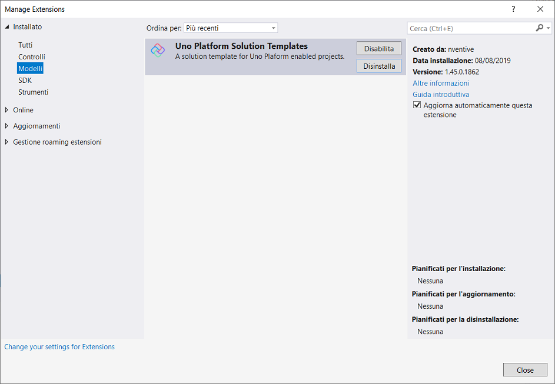

# SOMMARIO
1. [PLATFORM UNO](#paragraph1)
2. [UNO CALCULATOR](#paragraph2)

# PLATFORM UNO 

 

## INTRODUZIONE

 [GitHub](https://github.com/nventive/)

 [Platform Uno](https://platform.uno/)

## Architettura

Su iOS e Android si basa nello stack di Xamarin nativo.

WASM si basa direttamente sul runtime Mono-WASM.

Esegue solo codebase, C# e XAML su tutte queste piattaforme.

 

## Creare un progetto

In Visual Studio fare clic su ***Estensioni/Gestisci le estensioni***.

Per prima cosa, si creerà un progetto Cross-Platform. Il tipo di progetto include fin dall'inizio tutti i file modello necessari.

1. Aprire Visual Studio 2019.
2. Nella finestra iniziale scegliere ***Crea un nuovo progetto***.
3. Nella finestra ***Crea un nuovo progetto*** immettere o digitare *Uno Platform* nella casella di ricerca. 

Dopo aver applicato i filtri di linguaggio e piattaforma, scegliere il modello ***Cross-Platform App (Uno Platform* ** e quindi scegliere ***Avanti***.

4. Nella finestra ***Configura il nuovo progetto*** digitare o immettere *Primo_Progetto_PU* nella casella ***Nome del progetto***. Scegliere ***Crea***.

## Creare l'app

Quando si crea il progetto, si genera la seguente soluzione.

In ***Esplora soluzioni*** espandere la cartelle.

## Esecuzione dell'app

 A questo punto è possibile compilare, distribuire e avviare l'app web per verificarne l'aspetto. 

1.  Fare clic su ***IIS Express*** come destinazione di debug.
2. Seleziona ***Web browser (Microsoft Edge Canary)***.
3. Assicurarsi che il ***Debug degli script (disabilitato)***.
4. Fare clic su ***Debug/Avvia senza eseguire debug (CTRL+F5)***.

Si apre Microsoft Edge Canary.

## DEBUG SU WASM

Il debug funziona sui seguenti browser.

1. Microsoft Edge Canary.
2. Chrome e utilizza il [**Protocollo Chrome DevTools**]([**https://chromedevtools.github.io/devtools-protocol/**](https://chromedevtools.github.io/devtools-protocol/)).

 

Il proxy debugger è un componente di base di ASP.NET da Mono che è incorporato all’interno del server di file statico ASP.NET Core utilizzato durante lo sviluppo.

Il suo ruolo è quello accedere ai file **PDB** (*Program DataBase*), interpretare i comandi del debugger e tradurli per il runtime di Mono-WASM.

Platform Uno utilizza una versione personalizzata di proxy del debug che aggiunge il supporto per sorgenti Mono.

In Microsoft Edge Canary fare clic su ***Altri strumenti/Strumenti di sviluppo(CTRL+MAIUSC+I)***.

# UNO CALCULATOR 

Microsoft ha reso open source il codice della [calcolatrice](https://github.com/Microsoft/calculator/) implementata in Windows 10.

 È costruita interamente utilizzando lo standard C++ 11/CX, un motore di calcolo del 1995, storicamente, parti del codice C++ in realtà sono state costruite in C.

Platform Uno ha realizzando un porting della calcolatrice di Windows 10 per tutte le piattaforme in [C#](https://github.com/nventive/calculator/).

 È possibile anche utilizzarla dal browser con [WASM](https://calculator.platform.uno7).

 

Per essere in grado di richiamare codice WASM direttamente da C# mediante `P/Invoke`, Mono è stato aggiornato. Due modalità sono disponibili.

1. Compilazioni basate su interprete: utilizza la funzionalità di collegamento dinamico di emscripten ed è necessario costruire un’applicazione WASM senza dover fare affidamento sugli strumenti di emscripten. Ciò garantisce che il ciclo di sviluppo sia il più efficiente possibile, anche se a scapito delle prestazioni di runtime.
2. Compilazioni basate su **AOT** (*Ahead Of Time*): utilizza funzionalità di collegamento statico di Mono, dove Mono genera un insieme di metodi in moduli di codice bit di emscripten. Questa modalità è la più efficiente ma anche la più lenta da generare.

La soluzione.

 

Esecuzione dell’app.

 