# Creare un'app Xamarin.Forms C# in Visual Studio

In questa esercitazione per C# si userà Visual Studio per creare ed eseguire un'app Xamarin.Forms ed esplorare nello stesso tempo alcune funzionalità dell'ambiente di sviluppo integrato **IDE** (*Integrated Development Environment*) di Visual Studio.

Se Visual Studio non è ancora installato, accedere alla pagina [Download di Visual Studio](https://visualstudio.microsoft.com/downloads/?utm_medium=microsoft&utm_source=docs.microsoft.com&utm_campaign=inline+link&utm_content=download+vs2019) per installarlo gratuitamente.


## Creare un progetto

 Per prima cosa, si creerà un progetto Xamarin.Forms. Il tipo di progetto include fin dall'inizio tutti i file modello necessari.

1. Aprire Visual Studio 2019.
2. Nella finestra iniziale scegliere ***Crea un nuovo progetto***.
3. Nella finestra ***Crea un nuovo progetto*** immettere o digitare *console* nella casella di ricerca. Scegliere quindi **C#**  dall'elenco ***Linguaggio*** e ***Windows*** dall'elenco ***Piattaforma***.

Dopo aver applicato i filtri di linguaggio e piattaforma, scegliere il modello ***App per dispositivi mobili (Xamarin.Forms)* ** e quindi scegliere ***Avanti***.

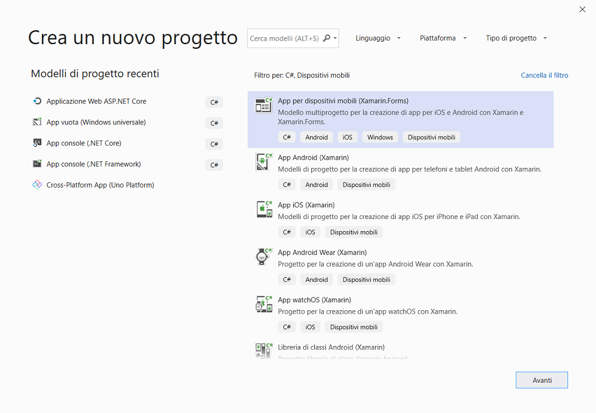

 Se il modello ***App per dispositivi mobili (Xamarin.Forms)*** non è visualizzato, è possibile installarlo dalla finestra ***Crea un nuovo progetto***. Nel messaggio ***L'elemento cercato non è stato trovato?*** scegliere il collegamento ***Installa altri strumenti e funzionalità***.

 Scegliere quindi il carico di lavoro ***Sviluppo mobile*** nel programma d'installazione di Visual Studio.

 Scegliere quindi il pulsante ***Modifica*** nel programma d'installazione di Visual Studio. Quando è richiesto, salvare il lavoro. Scegliere quindi ***Continua*** per installare il carico di lavoro. 

4. Nella finestra ***Configura il nuovo progetto*** digitare o immettere *Primo_Progetto_Xamarin* nella casella ***Nome del progetto***. Scegliere ***Crea***.

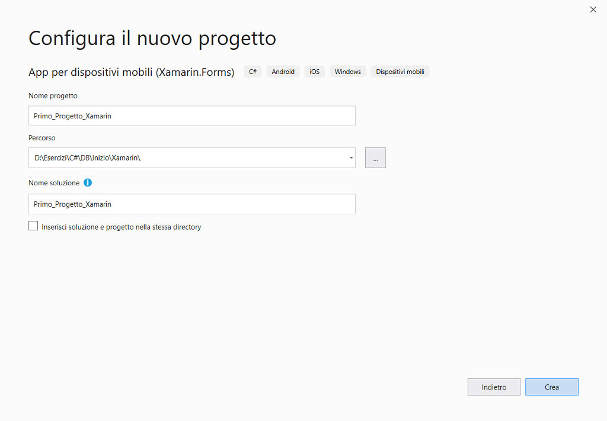

5. Nella finestra ***New Cross Platform App - Primo_Progetto_Xamarin*** verificare che ***Piattaforma*** verificare che siano selezionati ***Android***, ***iOS*** e ***Windows (UWP)***: Infine scegliere ***OK***.

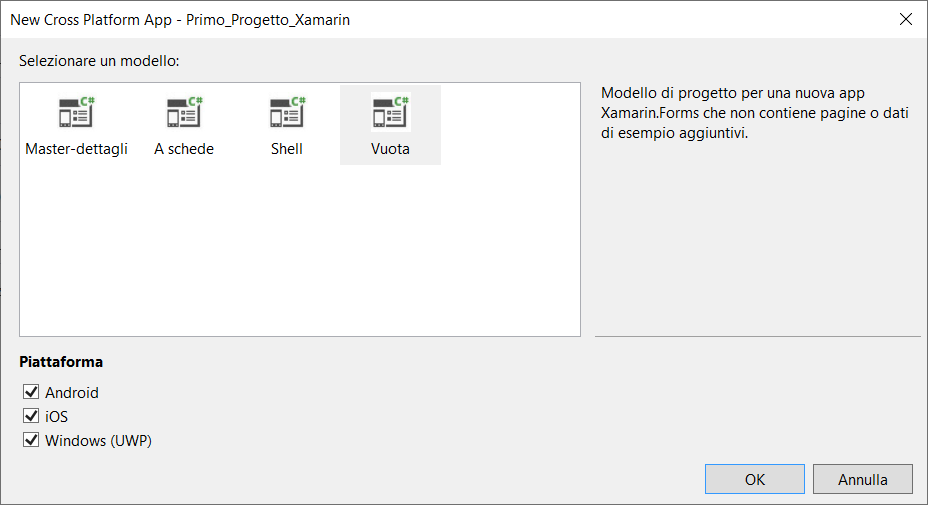


## Creare l'app

Il template crea una soluzione (SLN) composta da quattro progetti (CSPROJ), ognuno dei quali partecipa al processo di build generando un eseguibile (EXE) o una libreria (DLL).

La portabilità della soluzione è garantita dalla condivisione dello stesso engine di compilazione MSBUILD tra i diversi IDE.

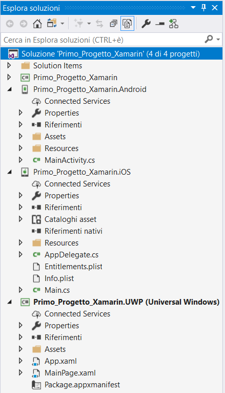


## 1. Primo_Progetto_Xamarin

Condivide modello, business logic e codice relativo all'**UI** (*User Interface*) C# o XAML, in pratica contiene la maggior parte del codice platform-independent .

Modificare il file *MainPage.xaml* .

```xaml
<?xml version="1.0" encoding="utf-8" ?>
<ContentPage xmlns="http://xamarin.com/schemas/2014/forms"
             xmlns:x="http://schemas.microsoft.com/winfx/2009/xaml"
             xmlns:d="http://xamarin.com/schemas/2014/forms/design"
             xmlns:mc="http://schemas.openxmlformats.org/markup-compatibility/2006"
             mc:Ignorable="d"
             x:Class="Primo_Progetto_Xamarin.MainPage">
    <StackLayout>
        <!-- inserire nuovi controlli qui -->
        <Label Text="Benvenut in Xamarin.Forms!" HorizontalOptions="Center"  VerticalOptions="CenterAndExpand" />
        <Button Margin="118,102,0,0" x:Name="BtnPremi" Text ="Premi!" Clicked="BtnPremi_Clicked" />
    </StackLayout>
</ContentPage>
```

Modificare *MainPage.xaml.cs* .

```csharp
using System.ComponentModel;
using Xamarin.Forms;

namespace Primo_Progetto_Xamarin
{
    /* ulteriori informazioni su come rendere visibile il codice personalizzato nel
     * visualizzatore anteprima Xamarin.Forms, visitare  https://aka.ms/xamarinforms-previewer */

    [DesignTimeVisible(false)]
    public partial class MainPage : ContentPage
    {
        public MainPage()
        {
            InitializeComponent();
        }

        private int count = 0;

        private void BtnPremi_Clicked(object sender, System.EventArgs e)
        {
            count++;
            ((Button)sender).Text = $"Hai fatto clic {count}.";
        }
    }
}
```

### Classe App

La classe di base `Application` offre le funzionalità seguenti che sono esposte nella sotto classe predefinita `App` del progetto.

- Una proprietà `MainPage`, dove dev'essere impostata la pagina iniziale per l'app.
- Un [dizionario `Properties`](https://docs.microsoft.com/it-it/xamarin/xamarin-forms/app-fundamentals/application-class#Properties_Dictionary) persistente per archiviare valori semplici per tutte le modifiche di stato del ciclo di vita.
- Una proprietà `Current` statica che contiene un riferimento all'oggetto app corrente.

 Espone inoltre [metodi del ciclo di vita](https://docs.microsoft.com/it-it/xamarin/xamarin-forms/app-fundamentals/app-lifecycle), ad esempio `OnStart`, `OnSleep` e `OnResume`, nonché eventi di navigazione modale.

 A seconda del modello scelto, la classe `App` può essere definita in uno dei due modi seguenti.

1. **C#** 
2. **XAML e C#**

 Per creare una classe ***App*** usando XAML, è necessario sostituire la classe ***App*** predefinita con una classe ***App*** XAML e il code-behind associato, come illustrato nell'esempio di codice seguente.

```xaml
<Application xmlns="http://xamarin.com/schemas/2014/forms"
             xmlns:x="http://schemas.microsoft.com/winfx/2009/xaml"
             x:Class="Photos.App">

</Application>
```

L'esempio di codice seguente illustra il code-behind associato.

```csharp
public partial class App : Application
{
    public App ()
    {
        InitializeComponent ();
        MainPage = new HomePage ();
    }
    ...
}
```

Oltre a impostare la proprietà [`MainPage`](https://docs.microsoft.com/it-it/dotnet/api/xamarin.forms.application.mainpage#Xamarin_Forms_Application_MainPage), il code-behind deve anche chiamare il metodo `InitializeComponent` per caricare e analizzare il codice XAML associato.

La proprietà `MainPage` della classe `Application` imposta la pagina radice dell'app.

 Ad esempio, è possibile creare nella classe `App` la logica che consente di visualizzare una pagina diversa in base al fatto che l'utente abbia eseguito o meno l'accesso.

 La proprietà `MainPage` dev'essere impostata nel costruttore `App`.

```csharp
public class App : Xamarin.Forms.Application
{
    public App ()
    {
      MainPage = new ContentPage { Title = "Esempio di ciclo di vita dell'app" }; 
      // la tua pagina qui
    }
}
```

###### Dizionario delle proprietà

 La sottoclasse `Application` ha un dizionario `Properties` statico che può essere usato per archiviare i dati, in particolare per l'uso nei metodi `OnStart`, `OnSleep` e `OnResume`. L'accesso può essere eseguito da qualsiasi punto del codice Xamarin.Forms usando `Application.Current.Properties`.

 Il dizionario `Properties` usa una chiave `string` e archivia un valore `object`.

 Ad esempio, è possibile impostare una proprietà `"id"` persistente in qualsiasi punto del codice (quando è selezionato un elemento, nel metodo `OnDisappearing` di una pagina o nel metodo `OnSleep`) come illustrato di seguito.

```csharp
Application.Current.Properties ["id"] = someClass.ID;
```

Nel metodo `OnStart` o `OnResume` è quindi possibile usare questo valore per ricreare l'esperienza dell'utente in qualche modo. Il dizionario `Properties` archivia elementi `object` quindi è necessario eseguire il cast del relativo valore prima di usarlo.

```csharp
if (Application.Current.Properties.ContainsKey("id"))
{
    var id = Application.Current.Properties ["id"] as int;
    // fare qualcosa con id
}
```

Verificare sempre la presenza della chiave prima di accedervi in modo da evitare errori imprevisti.

Il dizionario `Properties` è in grado di serializzare solo i tipi primitivi per l'archiviazione. Il tentativo di archiviare altri tipi, ad esempio `List<string>`, può avere esito negativo senza che appaiano avvisi.

###### Persistenza

 Il dizionario `Properties` è salvato automaticamente nel dispositivo. I dati aggiunti al dizionario saranno disponibili quando l'app torna dall'esecuzione in background o è riavviata.

 Xamarin.Forms 1.4 ha introdotto un metodo aggiuntivo per la classe `Application`, `SavePropertiesAsync()` che può essere chiamato per rendere permanente in modo proattivo il dizionario `Properties`. Questo consente di salvare le proprietà dopo gli aggiornamenti importanti senza rischiare che non siano serializzate a causa di un arresto anomalo o terminate dal sistema operativo.

### Classe Application

 Un'istanza di questa classe è creata in ogni progetto specifico della piattaforma e passata al metodo `LoadApplication` che rappresenta la posizione in cui l'elemento `MainPage` è caricato e visualizzato all'utente.

Un'implementazione completa della classe `Application` è illustrata di seguito.

```csharp
public class App : Xamarin.Forms.Application
{
    public App ()
    {
        MainPage = new ContentPage { Title = "Esempio di ciclo di vita dell'app" }; 
      // la tua pagina qui
    }

    protected override void OnStart()
    {
        // gestire l'avvio dell'app
        Debug.WriteLine ("OnStart");
    }

    protected override void OnSleep()
    {
        // gestire la sospensione dell'app 
        Debug.WriteLine ("OnSleep");
    }

    protected override void OnResume()
    {
        // gestire la ripresa dell'app
        Debug.WriteLine ("OnResume");
    }
}
```

###### Metodi del ciclo di vita

 La classe [`Application`](https://docs.microsoft.com/it-it/dotnet/api/xamarin.forms.application) contiene tre metodi virtuali che possono essere sottoposti a override per rispondere alle modifiche del ciclo di vita.

1. `OnStart` - chiamato all'avvio dell'applicazione.
2. `OnSleep` - chiamato ogni volta che l'applicazione passa in background.
3. `OnResume` - chiamato alla ripresa dell'applicazione, dopo il passaggio in background.

Non è disponibile alcun metodo per la terminazione dell'app. In circostanze normali, ovvero non in caso di arresto anomalo, la terminazione dell'app sarà eseguita dallo stato *OnSleep*, senza l'invio di notifiche aggiuntive al codice.

In Android il metodo `OnStart` sarà chiamato a rotazione oltre che al primo avvio dell'app, se l'attività principale non include `ConfigurationChanges = ConfigChanges.ScreenSize | ConfigChanges.Orientation` nell'attributo `[Activity()]`.

###### Eventi di notifica per le pagine

La classe [`Application`](https://docs.microsoft.com/it-it/dotnet/api/xamarin.forms.application) include due eventi che inviano notifica della comparsa e della scomparsa delle pagine.

1. [`PageAppearing`](https://docs.microsoft.com/it-it/dotnet/api/xamarin.forms.application.pageappearing) - Evento generato quando una pagina sta per apparire sullo schermo.
2. [`PageDisappearing`](https://docs.microsoft.com/it-it/dotnet/api/xamarin.forms.application.pagedisappearing) - Evento generato quando una pagina sta per scomparire dallo schermo.

 Questi eventi possono essere usati in scenari in cui si vuole tenere traccia delle pagine man mano che sono visualizzate sullo schermo.

Gli eventi [`PageAppearing`](https://docs.microsoft.com/it-it/dotnet/api/xamarin.forms.application.pageappearing) e [`PageDisappearing`](https://docs.microsoft.com/it-it/dotnet/api/xamarin.forms.application.pagedisappearing) sono generati dalla classe di base [`Page`](https://docs.microsoft.com/it-it/dotnet/api/xamarin.forms.page) subito dopo gli eventi [`Page.Appearing`](https://docs.microsoft.com/it-it/dotnet/api/xamarin.forms.page.appearing) e [`Page.Disappearing`](https://docs.microsoft.com/it-it/dotnet/api/xamarin.forms.page.disappearing), rispettivamente.

###### Eventi di spostamento modale

 Esistono quattro eventi nella classe [`Application`](https://docs.microsoft.com/it-it/dotnet/api/xamarin.forms.application), ognuno con argomenti propri che consentono di rispondere alla visualizzazione e alla chiusura di pagine modali.

1. `ModalPushing` - generato in caso di push modale di una pagina.
2. `ModalPushed` - generato dopo il push modale di una pagina.
3. `ModalPopping` - generato in caso di prelievo modale di una pagina.
4. `ModalPopped` - generato dopo il prelievo modale di una pagina.

Gli argomenti dell'evento `ModalPopping`, di tipo `ModalPoppingEventArgs`, contengono una proprietà `Cancel`. Quando `Cancel` è impostata su `true` il prelievo modale è annullato.


## 2. Primo_Progetto_Xamarin.Android

L'elemento `MainActivity` di Android eredita da `FormsAppCompatActivity`. Nell'override di `OnCreate` il metodo `LoadApplication` è chiamato con un'istanza della classe `App`.

```csharp
[Activity (Label = "App Lifecycle Sample", Icon = "@drawable/icon", Theme = "@style/MainTheme", MainLauncher = true,
    ConfigurationChanges = ConfigChanges.ScreenSize | ConfigChanges.Orientation)]
public class MainActivity : FormsAppCompatActivity
{
    protected override void OnCreate (Bundle bundle)
    {
        base.OnCreate (bundle);

        global::Xamarin.Forms.Forms.Init (this, bundle);

        LoadApplication (new App ()); // method is new in 1.3
    }
}
```

 A questo punto è possibile compilare, distribuire e avviare l'app Xamarin.Forms per verificarne l'aspetto.

1. Nella barra degli strumenti di Visual Studio fare clic con il pulsante destro del mouse sul progetto e selezionare ***Imposta come progetto di avvio***.
2. Avviare l'emulatore Android premendo la voce di menu ***Debug/Avvia debug (F5)***  o il pulsante di riproduzione (include il testo **Computer locale**) per avviare l'app nel PC locale.

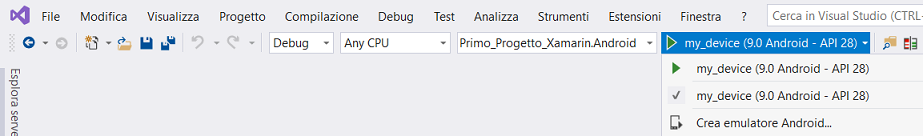

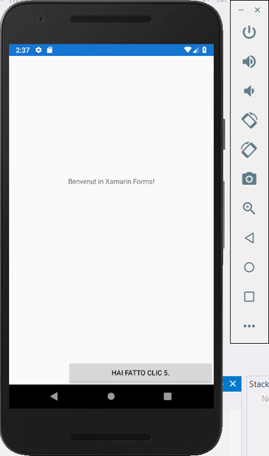


### Xamarin Profiler

È un'app autonoma integrata con Visual Studio per abilitare la profilatura all'interno dell'IDE.

 Scaricare il pacchetto di installazione per la piattaforma.

- [**macOS**](https://dl.xamarin.com/profiler/profiler-mac.pkg)
- [**Windows**](https://dl.xamarin.com/profiler/profiler-windows.msi)

 La profilatura è un passaggio importante e spesso trascurato nello sviluppo di app. La profilatura è un modulo di **analisi dinamica dei programmi**  che analizza il codice mentre è in esecuzione e in uso. Un profiler è uno strumento data mining che raccoglie informazioni sulla complessità temporale, l'utilizzo di metodi specifici e la memoria allocata. Un profiler consente di eseguire il drill-down approfondito e analizzare queste metriche per individuare le aree problematiche nel codice.

Un profiler fornisce informazioni approfondite sulle parti più utilizzate della codebase e consente di individuare le aree in cui è necessario dedicare più tempo alla creazione di miglioramenti. I programmatori devono tenere in considerazione la posizione in cui la maggior parte del tempo è impiegata nell'app e la modalità di utilizzo della memoria.

 La profilatura è utile in tutti i tipi di sviluppo ma è particolarmente importante per lo sviluppo di app per dispositivi mobili. Il codice non ottimizzato è molto più evidente sulle piattaforme mobili rispetto ai PC desktop e il successo dell'app dipende da un codice accattivante e ottimizzato che funziona in modo efficiente.

Prima di profilare l'app, è necessario consentire la profilatura nelle opzioni del progetto dell'app.

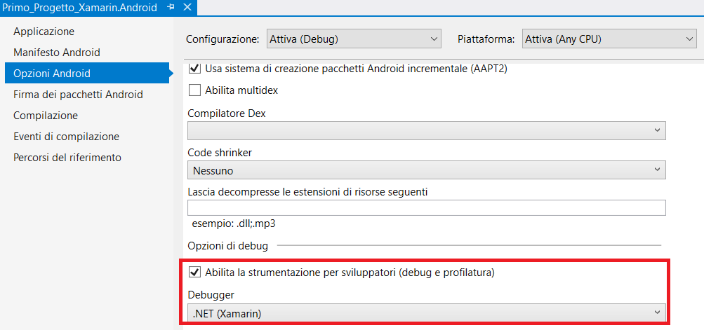

Avvio del profiler, fare clic su ***Analizza/Xamarin Profiler***.

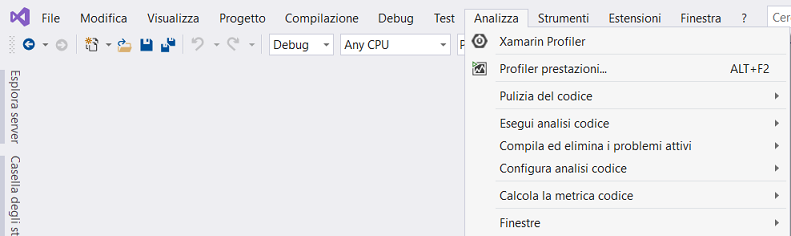

È avviato il profiler ed è avviata automaticamente la profilatura dell'app.

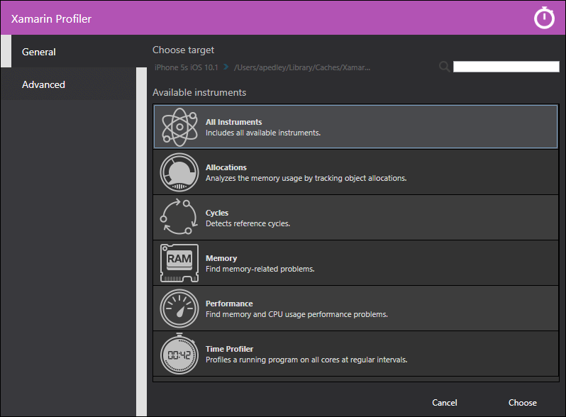

Per salvare una sessione di profilatura in qualsiasi momento, scegliere ***File/Salva con nome...*** dalla barra dei menu del profiler. Questo consente di salvare il file in formato *MLPD* , un formato speciale e altamente compresso per i dati di profilatura.

Xamarin Profiler è costituito da cinque sezioni.

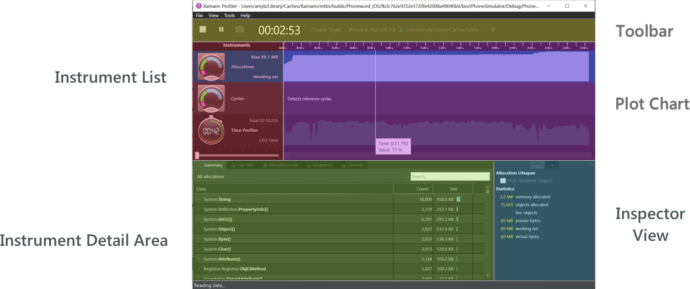

1. **Toolbar** : si trova nella parte superiore del profiler, offre opzioni per avviare/arrestare la profilatura, selezionare un processo di destinazione, visualizzare il tempo di esecuzione dell'app e selezionare le visualizzazioni divise che compongono l'app del profiler.
2. **Instrument list** : elenca tutti gli strumenti caricati per la sessione di profilatura.
3. **Plot Chart** dei tracciati: questi grafici sono correlati orizzontalmente agli strumenti pertinenti nell'elenco di strumenti. Per modificare la scala, è possibile usare un dispositivo di scorrimento (visualizzato sotto Profiler temporale).
4. **Instrument Detail Area** : contiene i dati visualizzati dalla visualizzazione selezionata dello strumento corrente. 
5. **Inspector View** : contiene le sezioni che possono essere selezionate dal controllo segmentato. Le sezioni dipendono dallo strumento selezionato e includono: Impostazioni di configurazione, statistiche, informazioni di analisi dello stack e percorso delle radici.

###### Allocazioni

 Fornisce informazioni dettagliate sugli oggetti dell'app durante la creazione e la **GC** (*Garbage Collection*).

 Nella parte superiore del profiler è disponibile il grafico allocazioni che consente di visualizzare la quantità di memoria allocata a intervalli regolari durante la profilatura. Attualmente il grafico allocazioni è il numero totale di allocazioni e non le dimensioni dell'heap in quel momento. In un certo senso, non sarà mai arrestato ma solo aumenterà. Sono inclusi gli oggetti allocati nello stack. A seconda della versione di runtime utilizzata, il grafico può avere un aspetto diverso, anche per la stessa app.

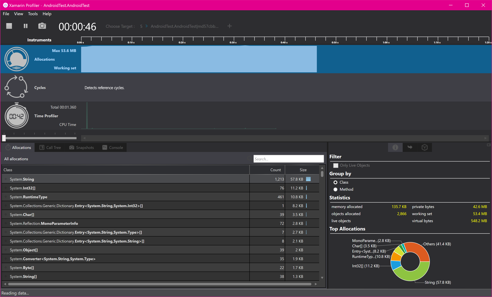

###### Profiler tempo

Misura esattamente la quantità di tempo impiegato in ogni metodo di un'app. L'app è sospesa a intervalli regolari ed è eseguita una traccia dello stack in ogni thread attivo. Ogni riga nell'area dei dettagli dello strumento mostra il percorso di esecuzione che è stato seguito.

 Il grafico dei tracciati, come illustrato nella schermata seguente, visualizza il numero di campioni ricevuti dall'app durante l'esecuzione.

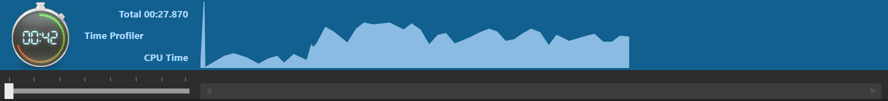

###### Cicli

Può essere abbastanza comune e semplice creare riferimenti a oggetti che non saranno mai eliminati. Questo strumento consente d'individuare tali oggetti e visualizzare i cicli cui è fatto riferimento nell'app.

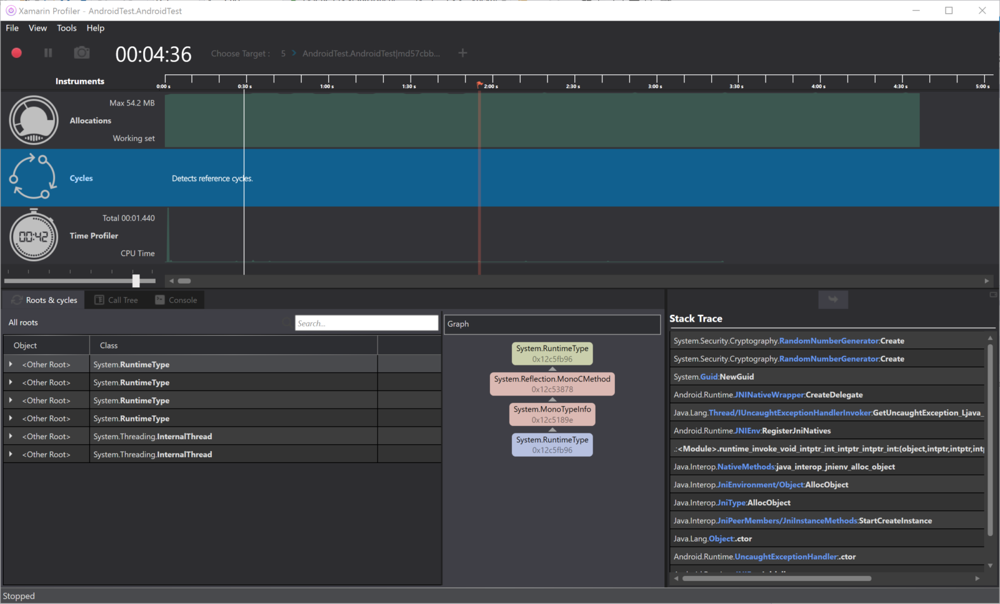


## 3. Primo_Progetto_Xamarin.iOS

La classe `AppDelegate` di iOS eredita da `FormsApplicationDelegate`. 

- Chiamare `LoadApplication` con un'istanza della classe `App`.
- Restituire sempre `base.FinishedLaunching (app, options);`.

```csharp
[Register ("AppDelegate")]
public partial class AppDelegate :
    global::Xamarin.Forms.Platform.iOS.FormsApplicationDelegate // superclass new in 1.3
{
    public override bool FinishedLaunching (UIApplication app, NSDictionary options)
    {
        global::Xamarin.Forms.Forms.Init ();

        LoadApplication (new App ());  // method is new in 1.3

        return base.FinishedLaunching (app, options);
    }
}
```

È possibile compilare ed eseguire il debug dell'app iOS da Visual Studio con un Mac in rete.

Vedere [Associa a Mac per lo sviluppo di Xamarin.iOS](https://docs.microsoft.com/it-it/xamarin/ios/get-started/installation/windows/connecting-to-mac/index).

 A questo punto è possibile compilare, distribuire e avviare l'app Xamarin.Forms per verificarne l'aspetto.

1. Nella barra degli strumenti di Visual Studio fare clic con il pulsante destro del mouse sul progetto e selezionare ***Imposta come progetto di avvio***.
2. Nella barra degli strumenti di Visual Studio premere il pulsante ***Avvia*** o il pulsante di riproduzione, per avviare l'app nel [simulatore iOS remoto](https://docs.microsoft.com/it-it/xamarin/tools/ios-simulator/index):.

Prima di profilare l'app, è necessario consentire la profilatura nelle opzioni del progetto dell'app.

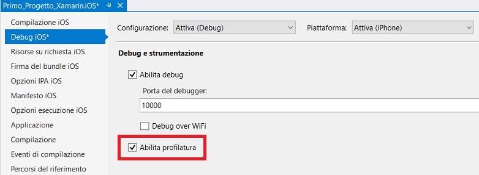


## 4. Primo_Progetto_Xamarin.UWP (Universal Windows)

La pagina principale nel progetto UWP deve ereditare da `WindowsPage`.

```xaml
<forms:WindowsPage
   ...
   xmlns:forms="using:Xamarin.Forms.Platform.UWP"
   ...>
</forms:WindowsPage>
```

La costruzione del code-behind in C# deve chiamare `LoadApplication` per creare un'istanza dell'elemento `App` di Xamarin.Forms. Si noti che è opportuno usare in modo esplicito lo spazio dei nomi dell'app per qualificare `App` poiché le app UWP usano anche una propria classe `App` non correlata a Xamarin.Forms.

```csharp
public sealed partial class MainPage
{
    public MainPage()
    {
        InitializeComponent();
        LoadApplication(new YOUR_NAMESPACE.App());
    }
 }
```

`Forms.Init()` dev'essere chiamato da **App.xaml.cs** nel progetto UWP.

 A questo punto è possibile compilare, distribuire e avviare l'app Xamarin.Forms per verificarne l'aspetto.

1. Nella barra degli strumenti di Visual Studio fare clic con il pulsante destro del mouse sul progetto e selezionare ***Imposta come progetto di avvio***.
2. Fare clic sulla voce di menu ***Debug/Avvia debug (F5)***  o il pulsante di riproduzione (include il testo **Computer locale**) per avviare l'app nel PC locale.

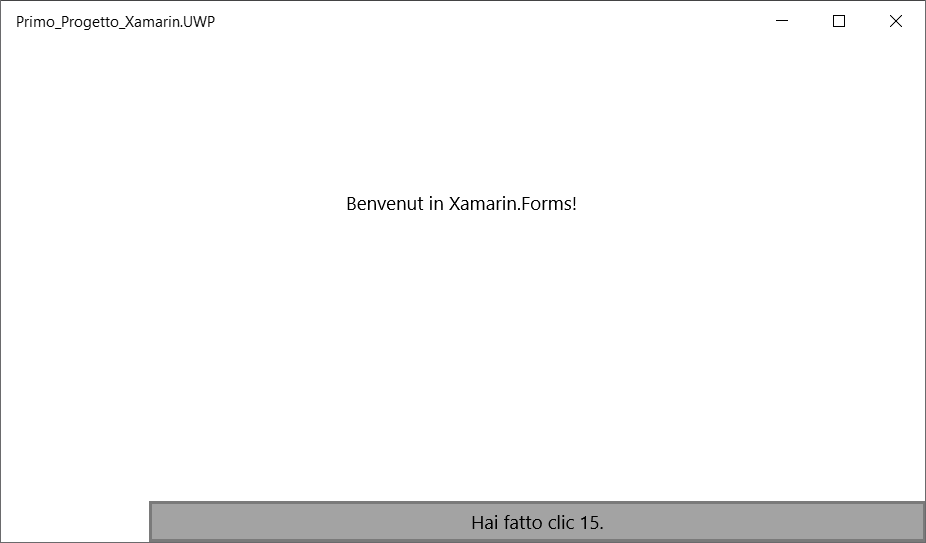


[Ebook Creazione di app per dispositivi mobili](https://docs.microsoft.com/it-it/xamarin/xamarin-forms/creating-mobile-apps-xamarin-forms/index) – Capitoli approfonditi che illustrano lo sviluppo di Xamarin.Forms. Disponibile in formato PDF, include centinaia di altri esempi.