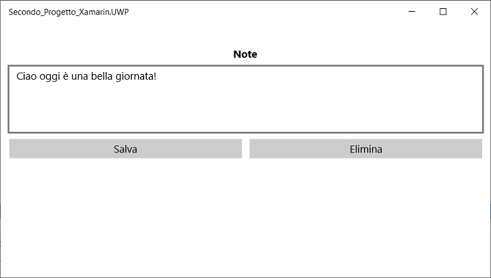

# Secondo_Progetto_Xamarin

Modificare il file *MainPage.xaml* .

Questo codice definisce in modo dichiarativo l'interfaccia utente per la pagina che [`Label`](https://docs.microsoft.com/it-it/dotnet/api/xamarin.forms.label) è costituita da un [`Editor`](https://docs.microsoft.com/it-it/dotnet/api/xamarin.forms.editor) oggetto per visualizzare il testo, [`Button`](https://docs.microsoft.com/it-it/dotnet/api/xamarin.forms.button) un oggetto per l'input di testo e due istanze che indirizzano l'app al salvataggio o all'eliminazione di un file. Le due istanze di `Button` sono disposte orizzontalmente in un oggetto [`Grid`](https://docs.microsoft.com/it-it/dotnet/api/xamarin.forms.grid), con `Label`, `Editor` e `Grid` disposti verticalmente in un oggetto [`StackLayout`](https://docs.microsoft.com/it-it/dotnet/api/xamarin.forms.stacklayout). 

```xaml
<?xml version="1.0" encoding="utf-8" ?>
<ContentPage xmlns="http://xamarin.com/schemas/2014/forms"
             xmlns:x="http://schemas.microsoft.com/winfx/2009/xaml"
             xmlns:d="http://xamarin.com/schemas/2014/forms/design"
             xmlns:mc="http://schemas.openxmlformats.org/markup-compatibility/2006"
             mc:Ignorable="d"
             x:Class="Secondo_Progetto_Xamarin.MainPage">
    <StackLayout Margin="10,35,10,10">
        <Label Text="Note"
               HorizontalOptions="Center"
               FontAttributes="Bold" />
        <Editor x:Name="editor"
                Placeholder="Inserisci la tua nota"
                HeightRequest="100" />
        <Grid>
            <Grid.ColumnDefinitions>
                <ColumnDefinition Width="*" />
                <ColumnDefinition Width="*" />
            </Grid.ColumnDefinitions>
            <Button Text="Salva"
                    Clicked="OnSaveButtonClicked" />
            <Button Grid.Column="1"
                    Text="Elimina"
                    Clicked="OnDeleteButtonClicked" />
        </Grid>
    </StackLayout>
</ContentPage>
```

Modificare *MainPage.xaml.cs* .

Questo codice definisce un campo `_fileName` che fa riferimento ad un file denominato `note.txt` che archivia i dati delle note nella cartella locale dei dati dell'app. 

C:\Users\massi\AppData\Local\Packages\3f9063b5-d21f-48b5-ab1d-199bf5b35a57_j3kef55cp0eqr\LocalState

Quando è eseguito il costruttore della pagina, il file è letto, se presente e visualizzato in [`Editor`](https://docs.microsoft.com/it-it/dotnet/api/xamarin.forms.editor). Quando si seleziona ***Salva*** premendo [`Button`](https://docs.microsoft.com/it-it/dotnet/api/xamarin.forms.button), è eseguito il gestore eventi `OnSaveButtonClicked` che consente di salvare il contenuto di `Editor` nel file. Se per selezionare ***Elimina*** si preme `Button`, è eseguito il gestore eventi `OnDeleteButtonClicked` che elimina il file, a condizione che esista e rimuove qualsiasi testo da `Editor`. 

```csharp
using System;
using System.ComponentModel;
using System.IO;
using Xamarin.Forms;

namespace Secondo_Progetto_Xamarin
{
    [DesignTimeVisible(false)]
    public partial class MainPage : ContentPage
    {
        private string _fileName = Path.Combine(Environment.GetFolderPath(Environment.SpecialFolder.LocalApplicationData), "note.txt");

        public MainPage()
        {
            InitializeComponent();
            if (File.Exists(_fileName))
                editor.Text = File.ReadAllText(_fileName);
        }

        private void OnSaveButtonClicked(object sender, EventArgs e)
        {
            File.WriteAllText(_fileName, editor.Text);
        }

        private void OnDeleteButtonClicked(object sender, EventArgs e)
        {
            if (File.Exists(_fileName))
                File.Delete(_fileName);
            editor.Text = string.Empty;
        }
    }
}
```


## Primo_Progetto_Xamarin.Android

 A questo punto è possibile compilare, distribuire e avviare l'app Xamarin.Forms per verificarne l'aspetto.

1. Nella barra degli strumenti di Visual Studio fare clic con il pulsante destro del mouse sul progetto e selezionare ***Imposta come progetto di avvio***.
2. Avviare l'emulatore Android premendo la voce di menu ***Debug/Avvia debug (F5)***  o il pulsante di riproduzione (include il testo **Computer locale**) per avviare l'app nel PC locale.


## Primo_Progetto_Xamarin.UWP (Universal Windows)

 A questo punto è possibile compilare, distribuire e avviare l'app Xamarin.Forms per verificarne l'aspetto.

1. Nella barra degli strumenti di Visual Studio fare clic con il pulsante destro del mouse sul progetto e selezionare ***Imposta come progetto di avvio***.
2. Fare clic sulla voce di menu ***Debug/Avvia debug (F5)***  o il pulsante di riproduzione (include il testo **Computer locale**) per avviare l'app nel PC locale.

